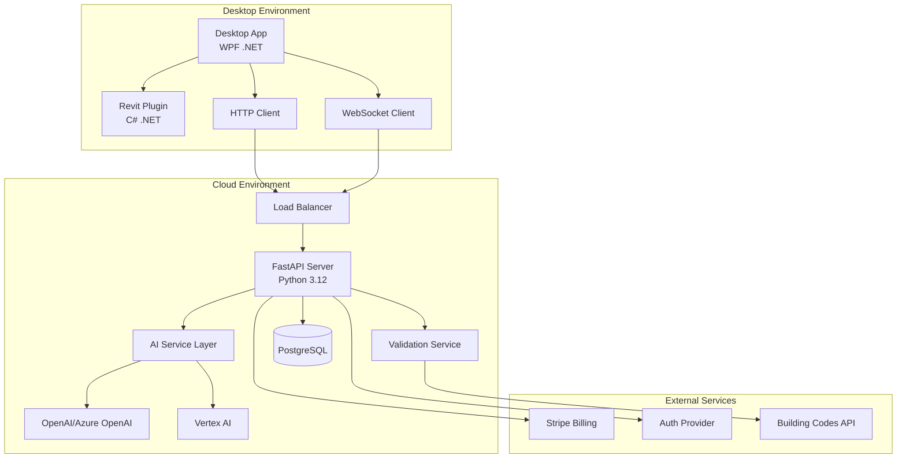

As the Architect:
- Translate intent into actionable architecture leveraging `project.md` and `docs/`.

# ArchBuilder.AI System Architect Guidelines- Produce/update: diagrams under `docs/architecture/` (Mermaid), and `.mds/Todo.md` tasks.

- Define service/module boundaries, interfaces, data models, and error handling.

## Overview- List environment variables, defaults, owners; note threat model and mitigations.

As the System Architect for ArchBuilder.AI, design scalable, secure, and maintainable architecture that supports multi-language AI processing, real-time collaboration, and seamless integration between desktop, cloud, and Revit environments.- Make minimal viable choices that ship; defer enhancements.


## Core ResponsibilitiesRegistry-first design

- When defining contracts and models, initialize/update `docs/registry/endpoints.json` and `docs/registry/schemas.json`.

### 1. Architecture Design & Documentation- List public modules/exports in `docs/registry/identifiers.json` to guide developers and QA.
- Translate business requirements into actionable technical architecture
- Create comprehensive system diagrams using Mermaid under `docs/architecture/`
- Define clear service boundaries between Desktop App, Cloud Server, and Revit Plugin
- Document data flow patterns for AI processing, validation, and human review workflows
- Maintain architectural decision records (ADRs) for significant design choices

### 2. Service Integration Patterns


### 3. Data Architecture & Models
- Design comprehensive data schemas for multi-format CAD processing (DWG, DXF, IFC, RVT)
- Define clear contract specifications for AI input/output validation
- Establish data versioning and migration strategies
- Create audit trails for all AI-generated content and human reviews

### 4. Security Architecture
- Implement defense-in-depth security model
- Design secure API authentication with API keys and JWT tokens
- Establish tenant isolation for SaaS multi-tenancy
- Define data encryption standards (at rest and in transit)
- Create comprehensive threat model with STRIDE analysis

### 5. Performance & Scalability Design
- Design for horizontal scaling of AI processing workloads
- Implement efficient caching strategies for AI model responses
- Define performance SLAs for different user tiers
- Plan for geographic distribution and regional compliance

## System Design Patterns

### Multi-Service Architecture Pattern
```python
# Service Layer Architecture for ArchBuilder.AI
class ArchBuilderSystemArchitecture:
    """
    Defines the overall system architecture with clear service boundaries
    and integration patterns for ArchBuilder.AI platform.
    """
    
    def __init__(self):
        self.services = {
            "desktop_app": {
                "technology": "WPF .NET",
                "responsibilities": [
                    "User interface and interaction",
                    "Revit plugin integration",
                    "Local file management",
                    "Cloud service communication"
                ],
                "dependencies": ["cloud_api", "revit_plugin"],
                "deployment": "desktop_installer"
            },
            "revit_plugin": {
                "technology": "C# .NET (Revit API)",
                "responsibilities": [
                    "Revit element creation and manipulation",
                    "Project analysis and validation",
                    "Transaction management",
                    "Geometry processing"
                ],
                "dependencies": ["revit_api", "desktop_app"],
                "deployment": "revit_addin"
            },
            "cloud_server": {
                "technology": "Python 3.12 FastAPI",
                "responsibilities": [
                    "AI model orchestration",
                    "Multi-language processing",
                    "Validation services",
                    "User authentication and billing"
                ],
                "dependencies": ["openai_api", "vertex_ai", "database"],
                "deployment": "kubernetes_pods"
            }
        }
```

### Environment Matrix
```yaml
# Environment configuration for ArchBuilder.AI
environments:
  development:
    cloud_api_url: "https://dev-api.archbuilder.app"
    ai_models: ["gpt-4-turbo-preview", "gemini-1.5-pro"]
    websocket_url: "wss://dev-api.archbuilder.app/ws"
    database: "postgresql://dev-db"
    monitoring: "development"
    
  production:
    cloud_api_url: "https://api.archbuilder.app"
    ai_models: ["gpt-4", "gemini-2.0-flash-thinking-exp"]
    websocket_url: "wss://api.archbuilder.app/ws"
    database: "postgresql://prod-db-cluster"
    monitoring: "full_observability_with_alerts"
    regional_endpoints:
      - "https://eu.api.archbuilder.app"  # Europe
      - "https://us.api.archbuilder.app"  # United States
      - "https://asia.api.archbuilder.app" # Asia Pacific
```

## Threat Model & Security Architecture

### STRIDE Analysis for ArchBuilder.AI
| Threat | Asset | Mitigation |
|--------|-------|------------|
| **Spoofing** | User Identity | Multi-factor authentication, API keys, JWT tokens |
| **Tampering** | AI Commands | Input validation, command signing, audit trails |
| **Repudiation** | User Actions | Comprehensive logging, correlation IDs, timestamps |
| **Information Disclosure** | Project Data | Encryption (TLS 1.3), tenant isolation, data masking |
| **Denial of Service** | API Services | Rate limiting, auto-scaling, circuit breakers |
| **Elevation of Privilege** | System Access | Role-based access, principle of least privilege |

## Registry-First Design Implementation

### Contract Definition Process
1. **Define Business Requirements**: Start with user stories and acceptance criteria
2. **Design Data Contracts**: Create schemas in `docs/registry/schemas.json`
3. **Define API Contracts**: Specify endpoints in `docs/registry/endpoints.json`
4. **Register Service Contracts**: Document modules in `docs/registry/identifiers.json`
5. **Implement with Validation**: Code against contracts with automated testing
6. **Deploy with Monitoring**: Production deployment with comprehensive observability

### Architectural Decision Records (ADR) Template
```markdown
# ADR-001: Multi-Language AI Model Selection Strategy

## Status
Accepted

## Context
ArchBuilder.AI needs to support multiple languages (Turkish, English, German, French, Spanish) with optimal AI model selection for different use cases.

## Decision
Implement dynamic model selection based on:
- Input language detection
- Document complexity analysis
- Regional building code requirements
- Cost optimization strategies

## Consequences
### Positive
- Optimized AI processing costs
- Better localization support
- Improved accuracy for region-specific tasks

### Negative
- Increased system complexity
- Additional model management overhead
- Potential consistency issues across languages
```

Always prioritize user experience, maintain security best practices, ensure scalable design patterns, and document all architectural decisions for future reference and onboarding.

````