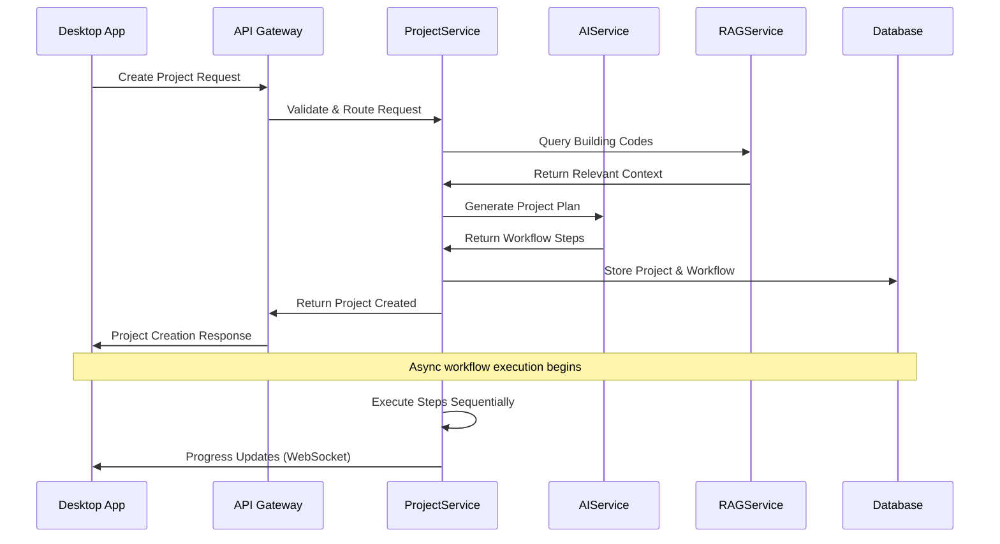
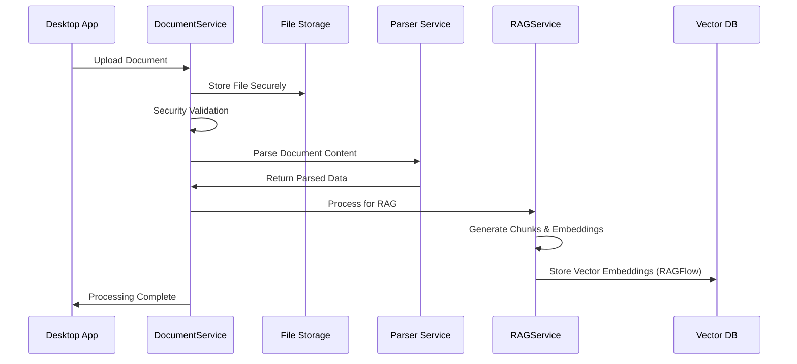
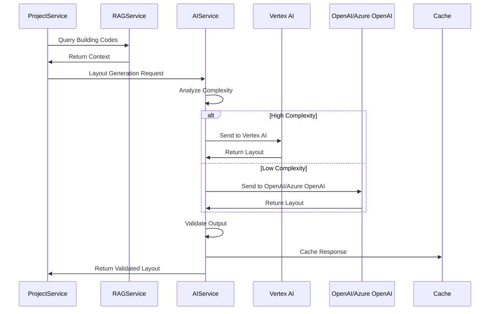
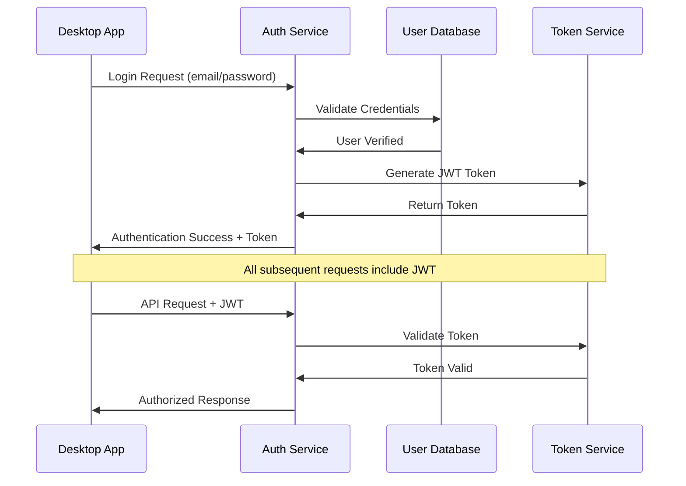

# Sistem Mimarisi Dökümantasyonu

ArchBuilder.AI, hybrid desktop-cloud architecture ile Windows masaüstü uygulaması ve cloud-based AI processing'i entegre eden comprehensive bir mimari tasarım sistemidir.

## 📋 İçindekiler

1. [Mimari Genel Bakış](#mimari-genel-bakış)
2. [System Components](#system-components)
3. [Data Flow Architecture](#data-flow-architecture)
4. [Security Architecture](#security-architecture)
5. [Scalability Design](#scalability-design)
6. [Technology Stack](#technology-stack)
7. [Deployment Architecture](#deployment-architecture)
8. [Performance Architecture](#performance-architecture)
9. [Integration Patterns](#integration-patterns)

## 🏗️ Mimari Genel Bakış

### High-Level Architecture
```mermaid
graph TB
    A[Windows Desktop App] -->|HTTPS/WebSocket| B[Cloud API Gateway]
    B --> C[FastAPI Backend]
    C --> D[AI Services Layer]
    C --> E[Document Processing]
    C --> F[RAG Knowledge Base]
    C --> G[Project Management]
    
    D --> H[Vertex AI]
    D --> I[OpenAI/Azure OpenAI]
    
    E --> J[File Storage]
    F --> K[Vector Database (via RAGFlow)]
    G --> L[PostgreSQL]
    
    M[Revit Plugin] -->|Local API| A
    N[Building Codes DB] --> F
    O[Redis Cache] --> C
```

### Core Principles
- **Hybrid Architecture**: Desktop UI + Cloud AI Processing
- **Microservices**: Loosely coupled, independently deployable services
- **Security-First**: End-to-end encryption, secure communication
- **Scalability**: Horizontal scaling for AI processing loads
- **Reliability**: Fallback mechanisms, error recovery
- **Performance**: Caching, async processing, real-time updates

## 🧩 System Components

### 1. Desktop Application Layer
```
ArchBuilder.AI Desktop (Windows WPF)
├── Presentation Layer
│   ├── Views/ (XAML, Apple-vari UI)
│   ├── ViewModels/ (MVVM pattern)
│   └── Controls/ (Custom UI components)
├── Business Logic Layer
│   ├── Services/ (Business services)
│   ├── Models/ (Data models)
│   └── Validators/ (Input validation)
├── Infrastructure Layer
│   ├── CloudClient/ (API communication)
│   ├── FileHandlers/ (Local file processing)
│   ├── Security/ (Encryption, auth)
│   └── Configuration/ (Settings, config)
└── Integration Layer
    ├── RevitAPI/ (Revit plugin communication)
    ├── FileSystem/ (Local file management)
    └── Networking/ (WebSocket, HTTP)
```

### 2. Cloud Services Layer
```
Cloud Backend (Python FastAPI)
├── API Gateway Layer
│   ├── Authentication/ (JWT, API keys)
│   ├── Authorization/ (RBAC, permissions)
│   ├── Rate Limiting/ (Request throttling)
│   └── Load Balancing/ (Request distribution)
├── Service Layer
│   ├── AIService/ (AI processing orchestration)
│   ├── DocumentService/ (File processing)
│   ├── RAGService/ (Knowledge management)
│   └── ProjectService/ (Workflow management)
├── Data Layer
│   ├── PostgreSQL/ (Relational data)
│   ├── Redis/ (Caching, sessions)
│   ├── Vector DB/ (Embeddings, similarity)
│   └── File Storage/ (Documents, models)
└── Integration Layer
    ├── Vertex AI/ (Google AI models)
    ├── OpenAI/Azure OpenAI/ (OpenAI models)
    ├── External APIs/ (Building codes, maps)
    └── Monitoring/ (Logging, metrics)
```

### 3. AI Processing Architecture
```
AI Services Layer
├── Model Selection Engine
│   ├── Complexity Analysis
│   ├── Cost Optimization
│   ├── Performance Routing
│   └── Fallback Logic
├── Provider Abstraction Layer
│   ├── Vertex AI Adapter
│   ├── GitHub Models Adapter
│   ├── Prompt Engineering
│   └── Response Validation
├── Processing Pipeline
│   ├── Input Preprocessing
│   ├── Context Assembly (RAG)
│   ├── Model Inference
│   └── Output Validation
└── Caching & Optimization
    ├── Response Caching
    ├── Model Routing Cache
    ├── Embedding Cache
    └── Performance Metrics
```

## 🔄 Data Flow Architecture

### Project Creation Flow


### Document Processing Flow


### AI Layout Generation Flow


## 🛡️ Security Architecture

### Security Layers
```
Security Architecture (Defense in Depth)
├── Network Security
│   ├── TLS 1.3 Encryption
│   ├── VPN for Admin Access
│   ├── DDoS Protection
│   └── Firewall Rules
├── Application Security
│   ├── Input Validation
│   ├── SQL Injection Prevention
│   ├── XSS Protection
│   └── CSRF Tokens
├── Authentication & Authorization
│   ├── Multi-Factor Authentication
│   ├── JWT Token Management
│   ├── API Key Rotation
│   └── Role-Based Access Control
├── Data Security
│   ├── Encryption at Rest (AES-256)
│   ├── Encryption in Transit
│   ├── Data Classification
│   └── Backup Encryption
└── Infrastructure Security
    ├── Container Security
    ├── Secret Management
    ├── Access Logging
    └── Vulnerability Scanning
```

### Authentication Flow


### Data Encryption Strategy
```python
# Encryption at Rest
{
    "user_data": "AES-256-GCM",
    "project_files": "AES-256-CBC",
    "ai_responses": "AES-256-GCM",
    "building_codes": "AES-256-CBC",
    "api_keys": "Argon2id + AES-256"
}

# Encryption in Transit
{
    "client_to_api": "TLS 1.3",
    "internal_services": "mTLS",
    "database_connections": "TLS + Certificate Pinning",
    "ai_model_apis": "TLS 1.3 + API Key"
}
```

## 📈 Scalability Design

### Horizontal Scaling Architecture
```
Load Balancer (HAProxy/nginx)
├── API Gateway Cluster (3+ nodes)
│   ├── Node 1: Primary
│   ├── Node 2: Secondary
│   └── Node 3: Backup
├── Service Cluster (Auto-scaling)
│   ├── AIService (2-10 instances)
│   ├── DocumentService (2-8 instances)
│   ├── RAGService (2-6 instances)
│   └── ProjectService (2-8 instances)
├── Database Cluster
│   ├── PostgreSQL Primary
│   ├── PostgreSQL Read Replicas (2+)
│   ├── Redis Cluster (3+ nodes)
│   └── Vector DB Cluster
└── Storage Layer
    ├── File Storage (S3/Azure Blob)
    ├── CDN for Static Assets
    └── Backup Storage
```

### Auto-Scaling Rules
```yaml
scaling_policies:
  ai_service:
    min_instances: 2
    max_instances: 10
    scale_up_threshold:
      cpu: 70%
      memory: 80%
      queue_length: 50
    scale_down_threshold:
      cpu: 30%
      memory: 40%
      queue_length: 10
  
  document_service:
    min_instances: 2
    max_instances: 8
    scale_up_threshold:
      cpu: 80%
      memory: 85%
      active_uploads: 20
    scale_down_threshold:
      cpu: 40%
      memory: 50%
      active_uploads: 5
```

### Performance Targets
```json
{
  "performance_sla": {
    "api_response_time": {
      "p50": "< 200ms",
      "p95": "< 500ms",
      "p99": "< 1000ms"
    },
    "ai_processing_time": {
      "simple_layout": "< 30 seconds",
      "complex_building": "< 5 minutes",
      "full_project": "< 30 minutes"
    },
    "document_processing": {
      "dwg_parsing": "< 2 minutes",
      "pdf_processing": "< 1 minute per 100 pages",
      "rag_integration": "< 30 seconds"
    },
    "availability": {
      "uptime_sla": "99.9%",
      "planned_downtime": "< 4 hours/month",
      "disaster_recovery": "< 1 hour RTO"
    }
  }
}
```

## 💻 Technology Stack

### Desktop Application Stack
```yaml
frontend:
  framework: "WPF (.NET Framework 4.8)"
  ui_design: "Apple-vari minimalist"
  mvvm_framework: "Prism/CommunityToolkit.Mvvm"
  http_client: "HttpClient with Polly"
  websocket: "ClientWebSocket"
  
data_binding:
  patterns: "MVVM, Command Pattern"
  validation: "IDataErrorInfo, FluentValidation"
  
security:
  encryption: "System.Security.Cryptography"
  storage: "Windows Credential Manager"
  
file_handling:
  formats: "DWG (ezdxf), PDF (PdfSharp), IFC"
  compression: "System.IO.Compression"
```

### Cloud Backend Stack
```yaml
api_framework: "FastAPI (Python 3.12+)"
async_runtime: "asyncio, uvloop"
web_server: "uvicorn with gunicorn"
api_gateway: "nginx + rate limiting"

databases:
  primary: "PostgreSQL 15+"
  cache: "Redis 7+"
  vector: "Chroma/Pinecone"
  search: "Elasticsearch (optional)"

ai_integration:
  vertex_ai: "Google Cloud Vertex AI"
  github_models: "Azure OpenAI Service"
  embeddings: "TF-IDF, Sentence-BERT"

background_tasks:
  queue: "Celery with Redis broker"
  scheduler: "Celery Beat"
  monitoring: "Flower"

monitoring:
  logging: "structlog + Elasticsearch"
  metrics: "Prometheus + Grafana"
  tracing: "OpenTelemetry"
  health_checks: "Custom health endpoints"
```

### Revit Integration Stack
```yaml
revit_plugin:
  framework: ".NET Framework 4.8"
  revit_api: "Revit 2026 API"
  architecture: "Command Pattern, Observer"
  
communication:
  protocol: "Named Pipes/HTTP"
  serialization: "JSON.NET"
  error_handling: "Polly retry policies"

data_models:
  shared_contracts: "Shared .NET Standard library"
  validation: "FluentValidation"
```

## 🚀 Deployment Architecture

### Cloud Infrastructure (Multi-Region)
```yaml
regions:
  primary: "us-central1 (Google Cloud)"
  secondary: "europe-west1"
  asia: "asia-southeast1"

infrastructure:
  container_platform: "Google Kubernetes Engine"
  service_mesh: "Istio"
  ingress: "nginx Ingress Controller"
  cert_management: "cert-manager (Let's Encrypt)"

ci_cd:
  source_control: "GitHub"
  ci_pipeline: "GitHub Actions"
  container_registry: "Google Container Registry"
  deployment: "Helm Charts + ArgoCD"

monitoring_stack:
  logging: "Google Cloud Logging + Elasticsearch"
  metrics: "Prometheus + Grafana"
  alerting: "AlertManager + PagerDuty"
  apm: "OpenTelemetry + Jaeger"
```

### Environment Strategy
```yaml
environments:
  development:
    replicas: 1
    resources: "minimal"
    ai_models: "lightweight"
    data: "synthetic"
    
  staging:
    replicas: 2
    resources: "production-like"
    ai_models: "full models"
    data: "anonymized production"
    
  production:
    replicas: "3+"
    resources: "high availability"
    ai_models: "optimized models"
    data: "encrypted production"
    backup: "cross-region"
```

### Container Architecture
```dockerfile
# Multi-stage build example
FROM python:3.13-slim as base
# Base dependencies

FROM base as builder
# Build dependencies and wheels

FROM base as production
# Production image with minimal dependencies
```

## ⚡ Performance Architecture

### Caching Strategy
```yaml
caching_layers:
  l1_memory_cache:
    technology: "Python dict + TTL"
    scope: "process-local"
    ttl: "5-60 minutes"
    use_cases: ["frequent queries", "session data"]
    
  l2_redis_cache:
    technology: "Redis Cluster"
    scope: "application-wide"
    ttl: "1-24 hours"
    use_cases: ["ai responses", "embeddings", "user sessions"]
    
  l3_cdn_cache:
    technology: "CloudFlare/CloudFront"
    scope: "global"
    ttl: "1-30 days"
    use_cases: ["static assets", "public docs"]

cache_patterns:
  write_through: "critical user data"
  write_behind: "analytics data"
  cache_aside: "ai model responses"
  refresh_ahead: "building codes"
```

### Database Optimization
```yaml
postgresql_optimization:
  connection_pooling: "PgBouncer (100-500 connections)"
  read_replicas: "2+ for read scaling"
  partitioning: "time-based for logs, hash for users"
  indexing: "btree, gin for jsonb, custom indexes"
  
query_optimization:
  prepared_statements: "enabled"
  query_planning: "auto_explain enabled"
  vacuum_scheduling: "automated"
  
redis_optimization:
  clustering: "3+ nodes with replication"
  persistence: "RDB + AOF"
  memory_policy: "allkeys-lru"
  connection_pooling: "redis-py connection pool"
```

### Real-time Communication
```yaml
websocket_architecture:
  technology: "FastAPI WebSockets"
  scaling: "Redis pub/sub for multi-instance"
  authentication: "JWT tokens in connection"
  heartbeat: "30 second ping/pong"
  
use_cases:
  project_progress: "real-time workflow updates"
  document_processing: "upload/parse progress"
  ai_generation: "step-by-step layout creation"
  collaboration: "multi-user project editing"
  
fallback_strategy:
  polling: "if WebSocket fails"
  frequency: "every 5-10 seconds"
  timeout: "30 seconds"
```

## 🔗 Integration Patterns

### Service Communication Patterns
```yaml
synchronous_patterns:
  http_rest: "user-facing operations"
  grpc: "internal service-to-service"
  graphql: "complex data queries (future)"
  
asynchronous_patterns:
  message_queues: "background processing"
  event_streaming: "real-time updates"
  pub_sub: "notifications"

reliability_patterns:
  circuit_breaker: "prevent cascade failures"
  retry_with_backoff: "transient error handling"
  timeout_management: "prevent hanging requests"
  bulkhead: "resource isolation"
```

### External Integration Architecture
```yaml
ai_providers:
  vertex_ai:
    authentication: "Service Account Keys"
    rate_limiting: "model-specific limits"
    fallback: "GitHub Models"
    
  github_models:
    authentication: "API Keys"
    rate_limiting: "tiered limits"
    fallback: "rule-based generation"

building_codes_integration:
  local_storage: "preprocessed regulations"
  periodic_updates: "weekly sync jobs"
  version_control: "git-like versioning"
  
revit_integration:
  communication: "Named Pipes (local)"
  api_compatibility: "Revit 2024-2026"
  plugin_updates: "automatic update checks"
```

### Data Integration Patterns
```yaml
data_pipelines:
  extract_transform_load:
    source: "uploaded documents"
    transform: "parsing + RAG processing"
    load: "vector database + search indexes"
    
  change_data_capture:
    source: "PostgreSQL"
    target: "analytics warehouse"
    frequency: "near real-time"
    
  event_sourcing:
    domain: "project workflows"
    events: "step_completed, validation_failed"
    projections: "progress views, analytics"
```

## 📊 Monitoring & Observability

### Monitoring Stack
```yaml
metrics:
  application_metrics:
    - "request_duration_seconds"
    - "ai_processing_time_seconds"
    - "document_parse_success_rate"
    - "project_completion_rate"
    
  infrastructure_metrics:
    - "cpu_usage_percent"
    - "memory_usage_bytes"
    - "disk_io_operations"
    - "network_bytes_transmitted"
    
  business_metrics:
    - "daily_active_users"
    - "projects_created_per_day"
    - "ai_model_usage_distribution"
    - "customer_satisfaction_score"

logging:
  structured_logging: "JSON format with correlation IDs"
  log_levels: "DEBUG, INFO, WARNING, ERROR, CRITICAL"
  retention: "30 days (hot), 1 year (cold)"
  
alerting:
  critical_alerts:
    - "service_down"
    - "high_error_rate (>5%)"
    - "ai_model_unavailable"
    - "database_connection_failure"
    
  warning_alerts:
    - "high_response_time (>1s)"
    - "memory_usage_high (>80%)"
    - "queue_length_growing"
    - "rate_limit_approaching"
```

---

**Bu dokümantasyon ArchBuilder.AI'ın complete system architecture'ını kapsamaktadır. Production deployment, scaling strategies ve monitoring approaches için detaylı implementation guidelines sağlar.**