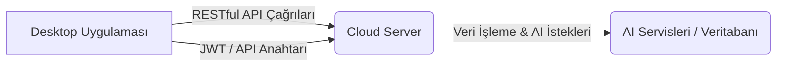

# Bulut İstemci Entegrasyonu Dokumentasyonu

## Genel Bakış
Bu belge, ArchBuilder.AI masaüstü uygulamasının bulut sunucusu (FastAPI) ile nasıl entegre olduğunu açıklamaktadır. Entegrasyon, çeşitli AI hizmetlerine erişim, belge işleme, proje yönetimi ve faturalandırma işlemlerini kapsar.

## Mimari
Masaüstü uygulaması, bulut sunucusu ile RESTful API çağrıları aracılığıyla iletişim kurar. Tüm iletişim HTTPS üzerinden şifrelenir ve JWT (JSON Web Token) veya API Anahtarları kullanılarak güvenli hale getirilir.



## Kurulum ve Bağımlılıklar

### Masaüstü Uygulaması (C#)
- `System.Net.Http`: HTTP istekleri göndermek için.
- `Newtonsoft.Json`: JSON serileştirme ve seri durumdan çıkarma için.
- `ArchBuilder.Services.AuthService`: Kimlik doğrulama ve token yönetimi.
- `ArchBuilder.Services.LoggerService`: Loglama için.

### Bulut Sunucusu (Python)
- FastAPI
- SQLAlchemy
- `python-jose`
- `passlib`

## Kullanım
Bulut istemcisi, `HttpClient` sınıfını kullanarak bulut sunucusunun API endpoint'lerine istek gönderir. Örnek olarak `AuthService` içindeki `LoginAsync` ve `RegisterAsync` metodları bu entegrasyonun temelini oluşturur.

### Örnek: AuthService ile Kullanıcı Girişi
```csharp
public async Task<LoginResult> LoginAsync(string email, SecureString password)
{
    try
    {
        string plainPassword = SecureStringToString(password);
        var loginRequest = new { username = email, password = plainPassword };
        var content = new StringContent(JsonConvert.SerializeObject(loginRequest), Encoding.UTF8, "application/json");

        var response = await _httpClient.PostAsync("auth/login", content);
        response.EnsureSuccessStatusCode();

        var responseContent = await response.Content.ReadAsStringAsync();
        var tokenResponse = JsonConvert.DeserializeObject<TokenResponse>(responseContent);

        // Kullanıcı oturumunu oluştur ve sakla
        CurrentUserSession = new UserSession(
            tokenResponse.UserId,
            email,
            tokenResponse.FirstName,
            tokenResponse.LastName,
            tokenResponse.AccessToken,
            tokenResponse.ApiKey,
            tokenResponse.SubscriptionTier,
            tokenResponse.UsageRemaining
        );

        _loggerService.LogInfo($"Kullanıcı girişi başarılı: {email}");
        return LoginResult.SuccessResult();
    }
    catch (HttpRequestException httpEx)
    {
        string errorResponse = await httpEx.GetResponseContentAsync();
        _loggerService.LogError($"Giriş hatası (HTTP): {httpEx.StatusCode} - {errorResponse}");
        return LoginResult.FailResult($"Giriş başarısız: {GetErrorMessageFromJson(errorResponse)}");
    }
    catch (Exception ex)
    {
        _loggerService.LogCritical($"Giriş sırasında beklenmedik hata: {ex.Message}");
        return LoginResult.FailResult($"Beklenmedik bir hata oluştu: {ex.Message}");
    }
}
```

## API Referansı

### Temel URL
`http://localhost:8000/api/` (Geliştirme Ortamı)

### Kimlik Doğrulama Endpoint'leri
- `POST /auth/register`: Yeni kullanıcı kaydı.
- `POST /auth/login`: Kullanıcı girişi ve JWT/API anahtarı alma.
- `POST /auth/refresh`: Yenileme token'ı ile erişim token'ını yenileme.
- `GET /auth/me`: Mevcut kullanıcı bilgilerini alma.
- `GET /auth/subscription`: Mevcut kullanıcının abonelik detaylarını alma.

### Hata Yönetimi
Bulut sunucusundan gelen hatalar standart HTTP durum kodları ile döndürülür (örn. `400 Bad Request`, `401 Unauthorized`, `403 Forbidden`, `404 Not Found`, `429 Too Many Requests`, `500 Internal Server Error`). Masaüstü uygulaması bu hataları yakalar ve kullanıcıya anlaşılır bir şekilde sunar.

Özel hata sınıfları (`RevitAutoPlanException` gibi) sunucu tarafında daha detaylı hata bilgisi sağlamak için kullanılır.

## Güvenlik
- **Token Tabanlı Kimlik Doğrulama**: JWT ve API Anahtarları kullanılarak her istek doğrulanır.
- **HTTPS**: Tüm iletişim şifreli kanallar üzerinden yapılır.
- **Giriş Doğrulama**: Tüm kullanıcı girişleri sunucu tarafında kapsamlı bir şekilde doğrulanır.
- **Rate Limiting**: API istismarına karşı istek sınırlamaları uygulanır.
- **Güvenlik Başlıkları**: HTTP güvenlik başlıkları (CSP, X-Frame-Options vb.) kullanılır.

## Konfigürasyon
Bulut sunucusunun temel URL'si, masaüstü uygulamasının yapılandırma dosyalarında (`appsettings.json` gibi) saklanmalı ve dinamik olarak yüklenebilir olmalıdır. Bu, farklı ortamlar (geliştirme, test, üretim) arasında kolay geçiş sağlar.

```csharp
// AuthService.cs içinde örnek yapılandırma kullanımı
_httpClient.BaseAddress = new Uri("http://localhost:8000/api/"); // AppSettings'ten okunacak
```

## Günlük Kaydı (Logging)
Bulut istemcisi ile ilgili tüm önemli olaylar ve hatalar `LoggerService` kullanılarak kaydedilir. Bu, sorun giderme ve uygulamanın sağlığını izleme için kritik öneme sahiptir.

```csharp
_loggerService.LogInfo($"Kullanıcı girişi başarılı: {email}");
_loggerService.LogError($"Giriş hatası (HTTP): {httpEx.StatusCode} - {errorResponse}");
```


