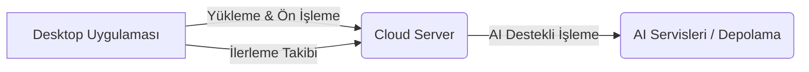

# Dosya İşleme Temelleri Dokumentasyonu

## Genel Bakış
Bu belge, ArchBuilder.AI masaüstü uygulamasının çeşitli CAD formatlarındaki (DWG/DXF, IFC, PDF) dosyaları nasıl işlediğini açıklamaktadır. Amaç, kullanıcıların doğal dil girdileriyle veya doğrudan dosya yüklemeleriyle projeler oluşturmasına olanak tanıyan bir temel sağlamaktır.

## Mimari
Dosya işleme, masaüstü uygulamasında başlar, burada dosyalar ön işlenir, doğrulanır ve ardından bulut sunucusuna yüklenir. Bulut sunucusu, AI destekli ayrıştırma, doğrulama, içerik çıkarma ve BIM model oluşturma gibi daha karmaşık işlemleri gerçekleştirir.



## Kurulum ve Bağımlılıklar

### Masaüstü Uygulaması (C#)
- `ArchBuilder.Services.LoggerService`: Loglama için.
- `ArchBuilder.CloudClient.CloudApiClient`: Bulut API'si ile iletişim için.
- `System.IO`: Dosya okuma/yazma işlemleri için.
- `System.Threading.Tasks`: Asenkron işlemler için.
- Gerekli NuGet paketleri: `Newtonsoft.Json` (API iletişiminde kullanılabilir).

### Bulut Sunucusu (Python)
- FastAPI
- Python dosya işleme kütüphaneleri (örn. `pypdf`, `ezdxf`, `ifcopenshell` - bunlar daha sonra eklenecek)
- AI modelleri (içerik çıkarma, nesne tanıma için)

## Kullanım
Dosya işleme akışı tipik olarak aşağıdaki adımları içerir:
1.  **Dosya Seçimi/Sürükle-Bırak**: Kullanıcı masaüstü uygulamasında dosya(ları) seçer veya sürükleyip bırakır.
2.  **Ön Doğrulama**: Masaüstü uygulaması temel dosya türü ve boyutu doğrulamaları yapar.
3.  **Buluta Yükleme**: Dosya, `CloudApiClient` aracılığıyla bulut sunucusunun `document/upload` endpoint'ine güvenli bir şekilde yüklenir.
4.  **İlerleme Takibi**: Yükleme ilerlemesi ve durumu kullanıcı arayüzünde gösterilir.
5.  **Bulut Tarafı İşleme**: Bulut sunucusu dosyayı AI modelleri ve özel ayrıştırıcılar kullanarak işler.
6.  **Sonuçlar**: İşleme sonuçları (örn. çıkarılan içerik, doğrulama raporları, oluşturulan BIM verileri) masaüstü uygulamasına geri gönderilir.

### Örnek: Temel Dosya İşleme Arayüzü (IFileHandler)
```csharp
using System.IO;
using System.Threading.Tasks;

namespace ArchBuilder.FileHandlers
{
    public interface IFileHandler
    {
        string SupportedExtension { get; }
        Task<FileProcessingResult> ProcessFileAsync(string filePath);
    }

    public class FileProcessingResult
    {
        public bool Success { get; set; }
        public string Message { get; set; }
        public string ProcessedContent { get; set; }
        // Diğer sonuçlar (örn. BIM verileri, doğrulama raporları)
    }
}
```

## API Referansı (Bulut Sunucusu)

### Belge Yükleme Endpoint'i
- `POST /api/documents/upload`: Yeni bir belgeyi yükler ve işleme kuyruğuna ekler.
  - **İstek**: `multipart/form-data` ile dosya içeriği ve isteğe bağlı metadata.
  - **Yanıt**: Yüklenen dosyanın ID'si, durumu ve işleme ilerlemesi.

### Belge Durum Endpoint'i
- `GET /api/documents/{document_id}/status`: Bir belgenin mevcut işleme durumunu döndürür.

## Hata Yönetimi
Dosya işleme sırasında çeşitli noktalarda hatalar oluşabilir:
-   **Masaüstü Tarafı Hataları**: Geçersiz dosya türü, dosya erişim sorunları, ağ bağlantısı kesilmesi.
-   **Bulut Tarafı Hataları**: Yükleme hatası, ayrıştırma hatası, AI işleme hatası, doğrulama hatası.

Tüm hatalar `LoggerService` aracılığıyla kaydedilmeli ve kullanıcıya anlaşılır mesajlarla bildirilmelidir. Bulut sunucusundan gelen hatalar, `CloudApiClient` tarafından yakalanarak `CloudClientException` olarak yeniden fırlatılmalıdır.

## Güvenlik
- **Güvenli Yükleme**: Dosyalar HTTPS üzerinden şifrelenir ve yükleme sırasında kimlik doğrulaması yapılır.
- **Giriş Doğrulama**: Yüklenen dosyaların türü, boyutu ve içeriği sunucu tarafında doğrulanır.
- **Depolama Güvenliği**: Yüklenen dosyalar güvenli bir şekilde depolanır ve erişim kontrolleri uygulanır.
- **Virüs Tarama**: Üretim ortamında yüklenen dosyalar için virüs taraması entegrasyon noktası düşünülmelidir.

## Konfigürasyon
Dosya boyut limitleri, desteklenen dosya türleri gibi ayarlar, masaüstü uygulamasının ve bulut sunucusunun yapılandırma dosyalarında tanımlanmalıdır.

## Günlük Kaydı (Logging)
Dosya yükleme, işleme başlangıcı/bitişi, hatalar ve önemli adımlar `LoggerService` kullanılarak detaylı bir şekilde kaydedilmelidir. Bu, sorun giderme ve işleme akışını izleme için esastır.
