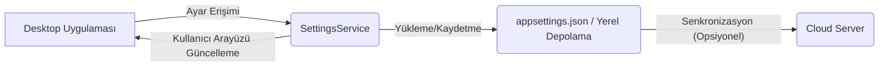

# Bölgesel Yapılandırma Sistemi Dokumentasyonu

## Genel Bakış
Bu belge, ArchBuilder.AI masaüstü uygulamasının dil, ölçü birimi, bölgesel bina kodları ve diğer kullanıcı tercihlerini yönetmek için kullanılan bölgesel yapılandırma sistemini açıklamaktadır. Amaç, uygulamanın farklı bölgelerdeki kullanıcılar için esnek ve uyumlu olmasını sağlamaktır.

## Mimari
Bölgesel yapılandırma sistemi, `appsettings.json` gibi yapılandırma dosyalarını ve kullanıcı tarafından depolanan yerel ayarları birleştirerek çalışır. `SettingsService` bu ayarları yükler, kaydeder ve diğer uygulama bileşenlerine sunar. Ayarlar genellikle uygulama başlangıcında yüklenir ve gerektiğinde dinamik olarak değiştirilebilir.



## Kurulum ve Bağımlılıklar

### Masaüstü Uygulaması (C#)
- `Microsoft.Extensions.Configuration`: Yapılandırma dosyalarını okumak için.
- `Microsoft.Extensions.Configuration.Json`: JSON yapılandırma dosyalarını desteklemek için.
- `System.IO`: Dosya işlemleri için.
- `Newtonsoft.Json`: Ayarları yerel depolamaya kaydetmek için.
- `ArchBuilder.Services.LoggerService`: Loglama için.

### Bulut Sunucusu (Python)
- FastAPI
- Yapılandırma dosyaları (örn. `configs/ai-prompts`, `configs/building-codes`)
- Bölgesel AI modelleri için özel prompt'lar.

## Kullanım
`SettingsService`, uygulama ayarlarını yönetmek için merkezi bir arayüz sağlar. Dil ayarları, metrik/emperyal birim seçenekleri ve tercih edilen bina kodu seti gibi ayarlar bu hizmet aracılığıyla erişilir ve güncellenir.

### Örnek: SettingsService Sınıfı
```csharp
using System;
using System.IO;
using ArchBuilder.Services;
using Newtonsoft.Json;

namespace ArchBuilder.Services
{
    public class AppSettings
    {
        public string Language { get; set; } = "tr-TR";
        public string MeasurementSystem { get; set; } = "Metric"; // Metric, Imperial
        public string RegionalBuildingCode { get; set; } = "Turkey"; // Turkey, USA, Europe, etc.
        public string CloudApiBaseUrl { get; set; } = "http://localhost:8000/api/";
        // Diğer uygulama ayarları...
    }

    public class SettingsService
    {
        private AppSettings _currentSettings;
        private readonly LoggerService _loggerService;
        private readonly string _settingsFilePath;

        public AppSettings CurrentSettings => _currentSettings;

        public SettingsService(LoggerService loggerService)
        {
            _loggerService = loggerService;
            _settingsFilePath = Path.Combine(Environment.GetFolderPath(Environment.SpecialFolder.ApplicationData), "ArchBuilder.AI", "appsettings.json");
            LoadSettings();
        }

        private void LoadSettings()
        {
            if (File.Exists(_settingsFilePath))
            {
                try
                {
                    string json = File.ReadAllText(_settingsFilePath);
                    _currentSettings = JsonConvert.DeserializeObject<AppSettings>(json);
                    _loggerService.LogInfo("Uygulama ayarları yüklendi.");
                }
                catch (Exception ex)
                {
                    _loggerService.LogError($"Ayarlar yüklenirken hata oluştu: {ex.Message}", ex);
                    _currentSettings = new AppSettings(); // Varsayılan ayarları yükle
                }
            }
            else
            {
                _currentSettings = new AppSettings(); // Varsayılan ayarları oluştur
                SaveSettings(); // İlk kez kaydet
                _loggerService.LogInfo("Varsayılan uygulama ayarları oluşturuldu.");
            }
        }

        public void SaveSettings()
        {
            try
            {
                Directory.CreateDirectory(Path.GetDirectoryName(_settingsFilePath));
                string json = JsonConvert.SerializeObject(_currentSettings, Formatting.Indented);
                File.WriteAllText(_settingsFilePath, json);
                _loggerService.LogInfo("Uygulama ayarları kaydedildi.");
            }
            catch (Exception ex)
            {
                _loggerService.LogError($"Ayarlar kaydedilirken hata oluştu: {ex.Message}", ex);
            }
        }

        public void UpdateSetting<T>(string propertyName, T value)
        {
            var property = typeof(AppSettings).GetProperty(propertyName);
            if (property != null && property.CanWrite)
            {
                property.SetValue(_currentSettings, value);
                SaveSettings();
                _loggerService.LogInfo($"Ayar güncellendi: {propertyName} = {value}");
            }
            else
            {
                _loggerService.LogWarning($"Ayar güncellenemedi: {propertyName} - Geçersiz özellik veya yazılabilir değil.");
            }
        }
    }
}
```

## API Referansı (Bulut Sunucusu)

Bulut sunucusu, bölgesel ayarları doğrudan masaüstü uygulamasından yönetmek için API endpoint'leri sağlayabilir. Örneğin, mevcut bina kodlarını listelemek veya AI prompt şablonlarını bölgesel ayarlara göre almak için endpoint'ler olabilir.

- `GET /api/configs/building-codes`: Desteklenen bina kodlarını listeler.
- `GET /api/configs/ai-prompts/{region}/{language}`: Belirli bir bölge ve dil için AI prompt şablonlarını döndürür.

## Hata Yönetimi
Ayarlar yüklenirken veya kaydedilirken oluşabilecek dosya erişim hataları veya serileştirme hataları `SettingsService` tarafından yakalanır ve `LoggerService` aracılığıyla kaydedilir. Kullanıcıya ayarların kaydedilemediği bilgisi verilebilir.

## Güvenlik
- **Yerel Depolama**: Ayarlar yerel olarak kaydedildiğinden, hassas bilgilerin (`API Anahtarları` gibi) doğrudan bu dosyalarda saklanmaması ve daha güvenli yöntemlerle (örn. Windows Credential Manager) yönetilmesi önemlidir.
- **İzinler**: Uygulamanın ayar dosyalarına yazma/okuma izinleri doğru şekilde yapılandırılmalıdır.

## Konfigürasyon
Uygulama varsayılan ayarları `AppSettings` sınıfında tanımlanır ve `appsettings.json` dosyası aracılığıyla üzerine yazılabilir. Bu, dağıtım kolaylığı ve esneklik sağlar.

## Günlük Kaydı (Logging)
Ayarların yüklenmesi, kaydedilmesi ve güncellenmesi gibi tüm işlemler `LoggerService` kullanılarak loglanır. Bu, yapılandırma sorunlarının teşhis edilmesine yardımcı olur.
