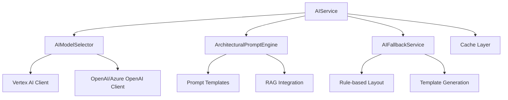

# AIService Dökümantasyonu

AIService, ArchBuilder.AI'ın kalbi olan AI işleme ve model yönetimi servisidir. Bu servis, Vertex AI ve OpenAI/Azure OpenAI'yi kullanarak mimari layout generation, requirement analysis ve Revit command generation işlemlerini gerçekleştirir.

## 📋 İçindekiler

1. [Genel Bakış](#genel-bakış)
2. [Mimari Yapı](#mimari-yapı)
3. [Ana Bileşenler](#ana-bileşenler)
4. [AI Model Yönetimi](#ai-model-yönetimi)
5. [Prompt Engineering](#prompt-engineering)
6. [Fallback Mekanizmaları](#fallback-mekanizmaları)
7. [Performans ve Cache](#performans-ve-cache)
8. [Kullanım Örnekleri](#kullanım-örnekleri)
9. [Hata Yönetimi](#hata-yönetimi)

## 🔍 Genel Bakış

AIService aşağıdaki temel işlevleri sağlar:

### Desteklenen AI Modelleri
- **Vertex AI**: Gemini-2.5-Flash-Lite (karmaşık projeler için)
- **OpenAI/Azure OpenAI**: GPT-4.1 (hızlı işlemler için)
- **Otomatik Model Seçimi**: Task complexity'e göre en uygun modeli seçer

### Ana İşlevler
- **Layout Generation**: AI destekli mimari layout oluşturma
- **Requirement Analysis**: Proje gereksinimlerini analiz etme
- **Site Analysis**: Arsa koşullarını değerlendirme
- **Validation**: Building code compliance kontrolü
- **Optimization**: Layout optimizasyonu
- **Revit Command Generation**: Revit API komutları oluşturma

## 🏗️ Mimari Yapı



## 🧩 Ana Bileşenler

### 1. AIModelSelector
Model seçimi ve yük dengeleme işlemlerini yönetir.

```python
class AIModelSelector:
    async def select_optimal_model(
        self,
        task_type: AITaskType,
        complexity_score: float,
        context_length: int
    ) -> AIModelConfig
```

**Özellikler**:
- Task complexity'e göre otomatik model seçimi
- Model availability kontrolü  
- Failover mekanizması
- Performance tracking

**Model Seçim Kriterleri**:
- **Basit görevler** (complexity < 0.3): OpenAI/Azure OpenAI (GPT-4.1)
- **Orta görevler** (0.3 ≤ complexity < 0.7): Vertex AI (Gemini-2.5-Flash-Lite)
- **Karmaşık görevler** (complexity ≥ 0.7): Vertex AI (Gemini-2.5-Flash-Lite)

### 2. ArchitecturalPromptEngine
Yapılandırılmış prompt generation ve RAG entegrasyonu.

```python
class ArchitecturalPromptEngine:
    async def generate_layout_prompt(
        self,
        request: AILayoutRequest,
        rag_context: Optional[str],
        language: str
    ) -> str
```

**Özellikler**:
- Çok dilli prompt templateleri
- RAG context integration
- Building code specific prompts
- Structured output formatting

**Prompt Yapısı**:
```
1. System Context (Mimari tasarım uzmanı rolü)
2. Project Requirements (Proje gereksinimleri)
3. RAG Context (İlgili yönetmelik kuralları)
4. Task Specification (Spesifik görev tanımı)
5. Output Format (JSON yapılandırması)
6. Safety Guidelines (Güvenlik kuralları)
```

### 3. AIFallbackService
AI hata durumlarında rule-based fallback sağlar.

```python
class AIFallbackService:
    async def generate_fallback_layout(
        self,
        request: AILayoutRequest
    ) -> AILayoutResponse
```

**Fallback Senaryoları**:
- AI model erişim hatası
- Düşük confidence score (<0.5)
- Rate limiting
- Timeout durumları

**Rule-based Generation**:
- Standart mimari kuralları
- Building type specific templates
- Minimum code compliance
- Basic space allocation

## 🤖 AI Model Yönetimi

### Model Configuration
```python
@dataclass
class AIModelConfig:
    provider: str  # "vertex_ai" or "github_models"
    model_name: str
    max_tokens: int
    temperature: float
    context_window: int
```

### Provider Implementations

#### Vertex AI Integration
```python
async def _call_vertex_ai(
    self,
    prompt: str,
    model_config: AIModelConfig,
    correlation_id: str
) -> AIResponse
```

**Özellikler**:
- Gemini-2.5-Flash-Lite model desteği
- Streaming response desteği
- Token usage tracking
- Error handling ve retry logic

#### GitHub Models Integration
```python
async def _call_github_models(
    self,
    prompt: str,
    model_config: AIModelConfig,
    correlation_id: str
) -> AIResponse
```

**Özellikler**:
- GPT-4.1 model desteği
- Faster response times
- Cost optimization
- Rate limiting management

## 📝 Prompt Engineering

### Template Sistemi
AIService çok dilli prompt template sistemi kullanır:

```
templates/
├── en/
│   ├── layout_generation.txt
│   ├── requirement_analysis.txt
│   └── validation.txt
├── tr/
│   ├── layout_generation.txt
│   ├── requirement_analysis.txt
│   └── validation.txt
└── ...
```

### Prompt Yapısı Örneği

#### Layout Generation Prompt (Türkçe)
```
Sen uzman bir mimar ve AI destekli tasarım uzmanısın.

PROJE BİLGİLERİ:
- Yapı Tipi: {building_type}
- Toplam Alan: {total_area} m²
- Kat Sayısı: {floors}
- Özel Gereksinimler: {requirements}

YÖNETMELİK KURALLARI:
{rag_context}

GÖREV:
Verilen gereksinimlere uygun mimari layout oluştur.

ÇIKTI FORMATI:
{
  "rooms": [...],
  "circulation": {...},
  "structure": [...],
  "compliance": {...}
}

GÜVENLİK KURALLARI:
- Yangın güvenliği kurallarına uy
- Yapısal güvenlik sağla
- Erişilebilirlik standartlarını karşıla
```

### RAG Context Integration
```python
# RAG context'i prompt'a entegre etme
rag_context = await self.rag_service.query_knowledge_base(
    query=f"Building codes for {request.building_type}",
    max_results=5,
    language=request.language
)

prompt = self.prompt_engine.generate_layout_prompt(
    request=request,
    rag_context=rag_context.formatted_content,
    language=request.language
)
```

## 🔄 Fallback Mekanizmaları

### Cascade Fallback Strategy
```python
async def generate_architectural_layout(
    self,
    request: AILayoutRequest,
    correlation_id: str
) -> AILayoutResponse:
    
    # Primary: AI Model
    try:
        ai_response = await self._process_with_ai(request)
        if ai_response.confidence_score >= 0.5:
            return ai_response
    except Exception:
        logger.warning("AI processing failed, trying fallback")
    
    # Secondary: Rule-based Fallback
    try:
        fallback_response = await self.fallback_service.generate_fallback_layout(request)
        return fallback_response
    except Exception:
        logger.error("All fallback mechanisms failed")
        raise AIServiceException("Layout generation completely failed")
```

### Fallback Quality Indicators
```python
class FallbackQuality(Enum):
    AI_HIGH_CONFIDENCE = "ai_high"      # >0.8 confidence
    AI_MEDIUM_CONFIDENCE = "ai_medium"  # 0.5-0.8 confidence
    AI_LOW_CONFIDENCE = "ai_low"        # <0.5 confidence  
    RULE_BASED = "rule_based"           # Fallback used
    HYBRID = "hybrid"                   # AI + Rules combined
```

## ⚡ Performans ve Cache

### Multi-layer Caching
```python
# 1. Memory Cache (hızlı erişim)
self.memory_cache: Dict[str, Any] = {}

# 2. Redis Cache (paylaşımlı cache)
self.redis_cache: AsyncCache = AsyncCache()

# 3. Model Response Cache
cache_key = f"ai_response:{prompt_hash}:{model_name}"
```

### Cache Stratejisi
- **Prompt Responses**: 1 saat TTL
- **Model Metadata**: 24 saat TTL
- **Fallback Templates**: 7 gün TTL
- **RAG Context**: 30 dakika TTL

### Performance Tracking
```python
@dataclass
class AIPerformanceMetrics:
    model_used: str
    response_time_ms: int
    token_count: int
    confidence_score: float
    cache_hit: bool
    fallback_used: bool
```

## 💡 Kullanım Örnekleri

### Basit Layout Generation
```python
# Layout generation request
request = AILayoutRequest(
    user_input="3 bedroom apartment with modern design",
    project_type="residential",
    building_type="apartment",
    total_area=120.0,
    floors=1,
    language="tr"
)

# Generate layout
response = await ai_service.generate_architectural_layout(
    request, correlation_id="proj_123"
)

# Response içeriği
if response.success:
    print(f"Layout generated with {response.confidence_score} confidence")
    print(f"Rooms: {len(response.layout_data['rooms'])}")
    print(f"Revit commands: {len(response.revit_commands)}")
```

### Requirement Analysis
```python
# Requirement analysis
analysis_request = AILayoutRequest(
    user_input="Hospital building with emergency department",
    building_type="hospital",
    language="en"
)

response = await ai_service.analyze_project_requirements(
    analysis_request, correlation_id="analysis_456"
)

# Extracted requirements
requirements = response.layout_data.get("requirements", [])
regulations = response.layout_data.get("regulations", [])
```

### Site Analysis
```python
# Site conditions analysis
site_request = AILayoutRequest(
    user_input="Analyze site for office building",
    building_type="office",
    site_constraints=["sloped terrain", "north-facing"],
    language="tr"
)

response = await ai_service.analyze_site_conditions(
    site_request, correlation_id="site_789"
)

# Site analysis results
constraints = response.layout_data.get("constraints", [])
recommendations = response.layout_data.get("recommendations", [])
```

## 🚨 Hata Yönetimi

### Exception Hierarchy
```python
AIServiceException
├── ModelNotAvailableException
├── PromptGenerationException
├── ValidationException
├── RateLimitException
└── FallbackFailedException
```

### Error Handling Strategy
```python
try:
    response = await ai_service.generate_architectural_layout(request)
except ModelNotAvailableException:
    # Switch to alternative model
    response = await ai_service._retry_with_fallback_model(request)
except RateLimitException:
    # Implement exponential backoff
    await asyncio.sleep(calculate_backoff_delay())
    response = await ai_service._retry_request(request)
except ValidationException as e:
    # Log validation errors and use rule-based fallback
    logger.error(f"AI output validation failed: {e}")
    response = await fallback_service.generate_fallback_layout(request)
```

### Monitoring ve Alerting
```python
# Performance monitoring
log_ai_operation(
    operation="layout_generation",
    model_used=response.model_info.model_name,
    input_tokens=response.token_usage.input_tokens,
    output_tokens=response.token_usage.output_tokens,
    response_time_ms=response.processing_time_ms,
    confidence_score=response.confidence_score,
    correlation_id=correlation_id
)

# Alert conditions
if response.confidence_score < 0.3:
    alert_low_confidence(correlation_id, response)
    
if response.processing_time_ms > 30000:  # 30 seconds
    alert_slow_response(correlation_id, response)
```

## 📊 Performance Metrikleri

### Target Performance
- **Simple Layout**: <30 seconds
- **Complex Layout**: <5 minutes
- **API Response Time**: <500ms (cached)
- **Model Switching**: <2 seconds
- **Confidence Score**: >0.7 average

### Monitoring Dashboard
```python
{
    "ai_service_metrics": {
        "total_requests": 1247,
        "success_rate": 0.94,
        "average_confidence": 0.78,
        "average_response_time_ms": 12500,
        "cache_hit_rate": 0.23,
        "fallback_usage_rate": 0.06,
        "model_distribution": {
            "vertex_ai": 0.72,
            "github_models": 0.28
        }
    }
}
```

## 🔧 Configuration

### Environment Variables
```bash
# AI Model Configuration
VERTEX_AI_PROJECT_ID=archbuilder-ai-project
VERTEX_AI_LOCATION=us-central1
GITHUB_MODELS_API_KEY=ghp_xxxxx

# Performance Tuning
AI_CACHE_TTL_SECONDS=3600
AI_REQUEST_TIMEOUT_SECONDS=120
AI_MAX_RETRIES=3
AI_FALLBACK_THRESHOLD=0.5

# Model Selection
DEFAULT_MODEL_PROVIDER=vertex_ai
ENABLE_FALLBACK=true
ENABLE_CACHING=true
```

### Model Limits
```python
MODEL_LIMITS = {
    "vertex_ai": {
        "max_tokens": 8192,
        "requests_per_minute": 60,
        "context_window": 32768
    },
    "github_models": {
        "max_tokens": 4096,
        "requests_per_minute": 180,
        "context_window": 16384
    }
}
```

---

**Bu dokümantasyon AIService'in tüm özelliklerini ve kullanımını kapsamaktadır. Daha detaylı bilgi için kaynak kodu incelenebilir.**