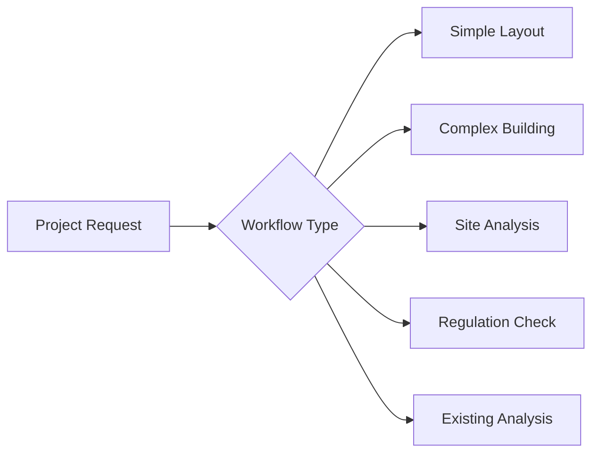

# ProjectService Dökümantasyonu

ProjectService, ArchBuilder.AI'ın proje yönetimi ve workflow orchestration motorudur. Bu servis, mimari projelerin step-by-step execution'ını yönetir ve AI, Document, RAG servislerini koordine ederek complete project workflows oluşturur.

## 📋 İçindekiler

1. [Genel Bakış](#genel-bakış)
2. [Workflow Orchestration](#workflow-orchestration)
3. [Project Lifecycle](#project-lifecycle)
4. [Step Types ve Execution](#step-types-ve-execution)
5. [Service Coordination](#service-coordination)
6. [Progress Tracking](#progress-tracking)
7. [Error Handling ve Recovery](#error-handling-ve-recovery)
8. [Kullanım Örnekleri](#kullanım-örnekleri)
9. [Performance Monitoring](#performance-monitoring)

## 🔍 Genel Bakış

ProjectService aşağıdaki temel işlevleri sağlar:

### Ana İşlevler
- **Project Creation**: Yeni mimari proje oluşturma
- **Workflow Orchestration**: Adım-adım project execution
- **Service Coordination**: AI, Document, RAG servis entegrasyonu
- **Progress Tracking**: Real-time progress monitoring
- **State Management**: Project state ve checkpoint yönetimi
- **Error Recovery**: Hata durumlarında recovery mechanisms

### Project Workflow Types


## 🏗️ Workflow Orchestration

### Project Workflow Architecture
```python
ProjectService
├── ProjectWorkflowOrchestrator  # Workflow coordination
├── StepExecutionEngine         # Individual step execution
├── ProgressTracker            # Progress monitoring
├── StateManager              # Project state management
├── ServiceCoordinator        # Inter-service communication
└── RecoveryManager           # Error recovery and rollback
```

### Workflow Types
```python
class ProjectWorkflowType(Enum):
    SIMPLE_LAYOUT = "simple_layout"           # 5-15 steps
    COMPLEX_BUILDING = "complex_building"     # 20-50 steps
    SITE_ANALYSIS = "site_analysis"          # 10-25 steps
    REGULATION_COMPLIANCE = "regulation"     # 8-20 steps
    EXISTING_ANALYSIS = "existing_analysis"  # 15-30 steps
    FULL_PROJECT = "full_project"           # 30-100 steps
```

### Step Types
```python
class WorkflowStepType(Enum):
    # Analysis Steps
    REQUIREMENT_ANALYSIS = "requirement_analysis"
    SITE_ANALYSIS = "site_analysis"
    REGULATION_CHECK = "regulation_check"
    EXISTING_BUILDING_ANALYSIS = "existing_analysis"
    
    # Design Steps
    CONCEPT_DESIGN = "concept_design"
    LAYOUT_GENERATION = "layout_generation"
    SPACE_OPTIMIZATION = "space_optimization"
    CIRCULATION_DESIGN = "circulation_design"
    
    # Technical Steps
    STRUCTURAL_DESIGN = "structural_design"
    MEP_INTEGRATION = "mep_integration"
    FIRE_SAFETY_CHECK = "fire_safety_check"
    ACCESSIBILITY_CHECK = "accessibility_check"
    
    # Documentation Steps
    DRAWING_GENERATION = "drawing_generation"
    SPECIFICATION_CREATION = "specification_creation"
    BIM_MODEL_CREATION = "bim_model_creation"
    
    # Validation Steps
    CODE_COMPLIANCE_CHECK = "code_compliance"
    DESIGN_VALIDATION = "design_validation"
    QUALITY_ASSURANCE = "quality_assurance"
    
    # Output Steps
    REVIT_COMMAND_GENERATION = "revit_commands"
    DOCUMENTATION_EXPORT = "documentation_export"
    PROJECT_FINALIZATION = "project_finalization"
```

## 🧩 Ana Bileşenler

### 1. ProjectWorkflowOrchestrator
Ana workflow coordination ve step sequencing.

```python
class ProjectWorkflowOrchestrator:
    async def create_and_execute_project(
        self,
        request: ProjectCreationRequest,
        correlation_id: str
    ) -> ProjectExecutionResponse
```

**Workflow Planning**:
```python
async def _plan_project_workflow(
    self,
    request: ProjectCreationRequest
) -> List[WorkflowStep]:
    
    steps = []
    
    # 1. Determine workflow type based on request complexity
    workflow_type = await self._determine_workflow_type(request)
    
    # 2. Get base workflow template
    template = await self._get_workflow_template(workflow_type)
    
    # 3. Customize based on specific requirements
    customized_steps = await self._customize_workflow_steps(
        template, request
    )
    
    # 4. Add dependencies and timing
    final_steps = await self._add_step_dependencies(customized_steps)
    
    return final_steps

async def _determine_workflow_type(
    self,
    request: ProjectCreationRequest
) -> ProjectWorkflowType:
    
    complexity_factors = {
        "building_type": self._get_building_complexity(request.building_type),
        "size": self._get_size_complexity(request.total_area),
        "floors": self._get_floor_complexity(request.floors),
        "special_requirements": len(request.special_requirements),
        "regulation_complexity": self._get_regulation_complexity(request.location)
    }
    
    total_complexity = sum(complexity_factors.values())
    
    if total_complexity < 0.3:
        return ProjectWorkflowType.SIMPLE_LAYOUT
    elif total_complexity < 0.6:
        return ProjectWorkflowType.COMPLEX_BUILDING
    else:
        return ProjectWorkflowType.FULL_PROJECT
```

### 2. StepExecutionEngine
Individual workflow step execution.

```python
class StepExecutionEngine:
    async def execute_step(
        self,
        step: WorkflowStep,
        project_context: ProjectContext,
        correlation_id: str
    ) -> StepExecutionResult
```

**Step Execution Patterns**:
```python
async def _execute_requirement_analysis(
    self,
    step: WorkflowStep,
    context: ProjectContext
) -> StepExecutionResult:
    
    # 1. Prepare AI request for requirement analysis
    ai_request = AILayoutRequest(
        user_input=context.project_request.user_input,
        project_type=context.project_request.project_type,
        building_type=context.project_request.building_type,
        task_type=AITaskType.REQUIREMENT_ANALYSIS,
        language=context.project_request.language
    )
    
    # 2. Get relevant knowledge base context
    rag_query = f"Requirements for {context.project_request.building_type} projects"
    rag_context = await self.rag_service.query_knowledge_base(
        query=rag_query,
        document_types=["regulation", "reference"],
        languages=[context.project_request.language],
        max_results=5
    )
    
    # 3. Execute AI analysis
    ai_response = await self.ai_service.analyze_project_requirements(
        request=ai_request,
        rag_context=rag_context.formatted_content,
        correlation_id=f"{context.correlation_id}_req_analysis"
    )
    
    # 4. Validate and store results
    if ai_response.success and ai_response.confidence_score >= 0.6:
        context.requirements = ai_response.layout_data.get("requirements", [])
        context.constraints = ai_response.layout_data.get("constraints", [])
        
        return StepExecutionResult(
            step_id=step.step_id,
            status=StepStatus.COMPLETED,
            execution_time_ms=ai_response.processing_time_ms,
            output_data=ai_response.layout_data,
            confidence_score=ai_response.confidence_score
        )
    else:
        return StepExecutionResult(
            step_id=step.step_id,
            status=StepStatus.FAILED,
            error_message="Requirements analysis failed or low confidence",
            confidence_score=ai_response.confidence_score if ai_response else 0.0
        )

async def _execute_layout_generation(
    self,
    step: WorkflowStep,
    context: ProjectContext
) -> StepExecutionResult:
    
    # 1. Prepare layout generation request
    ai_request = AILayoutRequest(
        user_input=context.project_request.user_input,
        project_type=context.project_request.project_type,
        building_type=context.project_request.building_type,
        total_area=context.project_request.total_area,
        floors=context.project_request.floors,
        task_type=AITaskType.LAYOUT_GENERATION,
        constraints=context.constraints,
        requirements=context.requirements,
        language=context.project_request.language
    )
    
    # 2. Get building code context
    rag_query = f"Layout requirements for {context.project_request.building_type}"
    rag_context = await self.rag_service.query_knowledge_base(
        query=rag_query,
        document_types=["regulation"],
        languages=[context.project_request.language],
        max_results=8
    )
    
    # 3. Generate layout
    ai_response = await self.ai_service.generate_architectural_layout(
        request=ai_request,
        rag_context=rag_context.formatted_content,
        correlation_id=f"{context.correlation_id}_layout_gen"
    )
    
    if ai_response.success:
        context.layout_data = ai_response.layout_data
        context.revit_commands.extend(ai_response.revit_commands)
        
        return StepExecutionResult(
            step_id=step.step_id,
            status=StepStatus.COMPLETED,
            execution_time_ms=ai_response.processing_time_ms,
            output_data=ai_response.layout_data,
            confidence_score=ai_response.confidence_score
        )
    else:
        return StepExecutionResult(
            step_id=step.step_id,
            status=StepStatus.FAILED,
            error_message="Layout generation failed"
        )
```

### 3. ProgressTracker
Real-time progress monitoring ve reporting.

```python
class ProgressTracker:
    async def update_project_progress(
        self,
        project_id: str,
        completed_step: WorkflowStep,
        remaining_steps: List[WorkflowStep]
    ) -> ProjectProgress
```

**Progress Calculation**:
```python
async def _calculate_progress_metrics(
    self,
    project_id: str,
    completed_steps: List[WorkflowStep],
    remaining_steps: List[WorkflowStep]
) -> ProgressMetrics:
    
    total_steps = len(completed_steps) + len(remaining_steps)
    completed_count = len(completed_steps)
    
    # Weight-based progress (complex steps worth more)
    total_weight = sum(step.complexity_weight for step in completed_steps + remaining_steps)
    completed_weight = sum(step.complexity_weight for step in completed_steps)
    
    # Time-based estimation
    avg_time_per_step = np.mean([step.execution_time_ms for step in completed_steps if step.execution_time_ms])
    estimated_remaining_time = avg_time_per_step * len(remaining_steps)
    
    return ProgressMetrics(
        project_id=project_id,
        total_steps=total_steps,
        completed_steps=completed_count,
        progress_percentage=completed_weight / total_weight * 100,
        estimated_completion_time=estimated_remaining_time,
        current_step=remaining_steps[0].step_name if remaining_steps else "Completed",
        average_step_time_ms=avg_time_per_step
    )
```

### 4. StateManager
Project state persistence ve checkpoint management.

```python
class StateManager:
    async def save_project_state(
        self,
        project_id: str,
        context: ProjectContext,
        checkpoint_name: str
    ) -> str
```

**State Management**:
```python
async def _create_project_checkpoint(
    self,
    project_id: str,
    context: ProjectContext,
    checkpoint_name: str
) -> ProjectCheckpoint:
    
    checkpoint = ProjectCheckpoint(
        checkpoint_id=f"checkpoint_{uuid.uuid4().hex[:8]}",
        project_id=project_id,
        checkpoint_name=checkpoint_name,
        created_at=datetime.utcnow(),
        project_state={
            "completed_steps": [step.to_dict() for step in context.completed_steps],
            "current_step": context.current_step.to_dict() if context.current_step else None,
            "remaining_steps": [step.to_dict() for step in context.remaining_steps],
            "requirements": context.requirements,
            "constraints": context.constraints,
            "layout_data": context.layout_data,
            "revit_commands": context.revit_commands,
            "progress_metrics": context.progress_metrics.to_dict()
        }
    )
    
    # Save to persistent storage
    await self._persist_checkpoint(checkpoint)
    
    return checkpoint

async def restore_project_state(
    self,
    project_id: str,
    checkpoint_id: str
) -> ProjectContext:
    
    # 1. Load checkpoint from storage
    checkpoint = await self._load_checkpoint(checkpoint_id)
    
    if not checkpoint or checkpoint.project_id != project_id:
        raise CheckpointNotFoundException(f"Checkpoint {checkpoint_id} not found")
    
    # 2. Reconstruct project context
    context = ProjectContext(
        project_id=project_id,
        correlation_id=f"restored_{uuid.uuid4().hex[:8]}",
        project_request=await self._load_original_request(project_id)
    )
    
    # 3. Restore state
    state = checkpoint.project_state
    context.completed_steps = [WorkflowStep.from_dict(step) for step in state["completed_steps"]]
    context.current_step = WorkflowStep.from_dict(state["current_step"]) if state["current_step"] else None
    context.remaining_steps = [WorkflowStep.from_dict(step) for step in state["remaining_steps"]]
    context.requirements = state["requirements"]
    context.constraints = state["constraints"]
    context.layout_data = state["layout_data"]
    context.revit_commands = state["revit_commands"]
    
    return context
```

## 🔄 Project Lifecycle

### Project States
```python
class ProjectStatus(Enum):
    CREATED = "created"                 # Project created, not started
    PLANNING = "planning"               # Workflow planning in progress
    IN_PROGRESS = "in_progress"         # Actively executing steps
    PAUSED = "paused"                  # Temporarily paused
    REVIEW_REQUIRED = "review_required" # Waiting for human review
    FAILED = "failed"                  # Execution failed
    COMPLETED = "completed"            # Successfully completed
    CANCELLED = "cancelled"            # Cancelled by user
```

### Lifecycle Management
```python
async def manage_project_lifecycle(
    self,
    project_id: str,
    action: ProjectAction,
    correlation_id: str
) -> ProjectLifecycleResponse:
    
    current_project = await self._get_project(project_id)
    
    if action == ProjectAction.START:
        return await self._start_project_execution(current_project, correlation_id)
    elif action == ProjectAction.PAUSE:
        return await self._pause_project_execution(current_project)
    elif action == ProjectAction.RESUME:
        return await self._resume_project_execution(current_project, correlation_id)
    elif action == ProjectAction.CANCEL:
        return await self._cancel_project_execution(current_project)
    elif action == ProjectAction.RETRY_STEP:
        return await self._retry_failed_step(current_project, correlation_id)
    else:
        raise InvalidProjectActionException(f"Unknown action: {action}")

async def _start_project_execution(
    self,
    project: Project,
    correlation_id: str
) -> ProjectLifecycleResponse:
    
    # 1. Plan workflow
    workflow_steps = await self.orchestrator.plan_project_workflow(
        request=project.original_request
    )
    
    # 2. Create execution context
    context = ProjectContext(
        project_id=project.project_id,
        correlation_id=correlation_id,
        project_request=project.original_request,
        workflow_steps=workflow_steps
    )
    
    # 3. Update project status
    await self._update_project_status(project.project_id, ProjectStatus.IN_PROGRESS)
    
    # 4. Start execution in background
    asyncio.create_task(self._execute_project_workflow(context))
    
    return ProjectLifecycleResponse(
        project_id=project.project_id,
        status=ProjectStatus.IN_PROGRESS,
        total_steps=len(workflow_steps),
        estimated_duration_minutes=self._estimate_project_duration(workflow_steps)
    )
```

## 🛠️ Service Coordination

### Inter-Service Communication
```python
class ServiceCoordinator:
    async def coordinate_services_for_step(
        self,
        step: WorkflowStep,
        context: ProjectContext
    ) -> ServiceCoordinationResult
```

**Service Coordination Patterns**:
```python
async def _coordinate_layout_generation_step(
    self,
    step: WorkflowStep,
    context: ProjectContext
) -> ServiceCoordinationResult:
    
    coordination_results = []
    
    # 1. Document Service: Get relevant drawings/references
    if context.uploaded_documents:
        doc_results = []
        for doc_id in context.uploaded_documents:
            doc_result = await self.document_service.get_processed_document(
                document_id=doc_id,
                correlation_id=f"{context.correlation_id}_doc_{doc_id}"
            )
            doc_results.append(doc_result)
        coordination_results.append(("document_service", doc_results))
    
    # 2. RAG Service: Get building code context
    rag_query = f"Layout requirements for {context.project_request.building_type}"
    rag_result = await self.rag_service.query_knowledge_base(
        query=rag_query,
        document_types=["regulation", "reference"],
        languages=[context.project_request.language],
        max_results=8
    )
    coordination_results.append(("rag_service", rag_result))
    
    # 3. AI Service: Generate layout
    ai_request = self._prepare_ai_layout_request(context, rag_result)
    ai_result = await self.ai_service.generate_architectural_layout(
        request=ai_request,
        correlation_id=f"{context.correlation_id}_ai_layout"
    )
    coordination_results.append(("ai_service", ai_result))
    
    # 4. Validate coordination results
    validation_result = await self._validate_coordination_results(
        coordination_results, step
    )
    
    return ServiceCoordinationResult(
        step_id=step.step_id,
        service_results=coordination_results,
        validation_result=validation_result,
        success=validation_result.is_valid
    )

async def _coordinate_compliance_check_step(
    self,
    step: WorkflowStep,
    context: ProjectContext
) -> ServiceCoordinationResult:
    
    # 1. RAG Service: Get specific regulations
    regulation_query = f"Building code compliance for {context.project_request.building_type}"
    regulation_context = await self.rag_service.query_knowledge_base(
        query=regulation_query,
        document_types=["regulation"],
        languages=[context.project_request.language],
        max_results=15
    )
    
    # 2. AI Service: Perform compliance analysis
    compliance_request = AILayoutRequest(
        user_input=f"Check compliance for: {context.layout_data}",
        project_type=context.project_request.project_type,
        building_type=context.project_request.building_type,
        task_type=AITaskType.COMPLIANCE_VALIDATION,
        layout_data=context.layout_data,
        language=context.project_request.language
    )
    
    compliance_result = await self.ai_service.validate_building_code_compliance(
        request=compliance_request,
        rag_context=regulation_context.formatted_content,
        correlation_id=f"{context.correlation_id}_compliance"
    )
    
    return ServiceCoordinationResult(
        step_id=step.step_id,
        service_results=[
            ("rag_service", regulation_context),
            ("ai_service", compliance_result)
        ],
        success=compliance_result.success
    )
```

## 📊 Progress Tracking

### Real-time Progress Updates
```python
@dataclass
class ProjectProgress:
    project_id: str
    current_status: ProjectStatus
    total_steps: int
    completed_steps: int
    current_step_name: str
    progress_percentage: float
    estimated_time_remaining_minutes: int
    step_execution_history: List[StepExecutionSummary]
    last_updated: datetime
```

**Progress Monitoring**:
```python
async def _monitor_project_progress(
    self,
    project_id: str,
    context: ProjectContext
) -> None:
    
    while context.current_step and context.current_step.status != StepStatus.COMPLETED:
        # Update progress metrics
        progress = await self.progress_tracker.calculate_current_progress(
            project_id, context
        )
        
        # Broadcast progress update
        await self._broadcast_progress_update(project_id, progress)
        
        # Check for timeout conditions
        if self._is_step_timeout(context.current_step):
            await self._handle_step_timeout(context.current_step, context)
        
        # Wait before next check
        await asyncio.sleep(5)  # Check every 5 seconds

async def _broadcast_progress_update(
    self,
    project_id: str,
    progress: ProjectProgress
) -> None:
    
    # Update database
    await self._persist_progress_update(project_id, progress)
    
    # Send WebSocket notification to client
    await self.websocket_manager.send_progress_update(
        project_id=project_id,
        progress=progress
    )
    
    # Log progress milestone
    if progress.progress_percentage % 10 == 0:  # Every 10%
        log_project_milestone(
            project_id=project_id,
            milestone=f"{progress.progress_percentage}% complete",
            current_step=progress.current_step_name
        )
```

## 🚨 Error Handling ve Recovery

### Error Recovery Strategies
```python
class RecoveryManager:
    async def handle_step_failure(
        self,
        failed_step: WorkflowStep,
        context: ProjectContext,
        error: Exception
    ) -> RecoveryResult
```

**Recovery Mechanisms**:
```python
async def _attempt_step_recovery(
    self,
    failed_step: WorkflowStep,
    context: ProjectContext,
    error: Exception
) -> RecoveryResult:
    
    recovery_strategies = []
    
    # 1. Retry with different parameters
    if isinstance(error, (AIServiceException, TemporaryServiceException)):
        retry_strategy = await self._plan_retry_strategy(failed_step, error)
        recovery_strategies.append(retry_strategy)
    
    # 2. Fallback to alternative approach
    if failed_step.step_type == WorkflowStepType.LAYOUT_GENERATION:
        fallback_strategy = await self._plan_fallback_layout_strategy(failed_step, context)
        recovery_strategies.append(fallback_strategy)
    
    # 3. Skip step if non-critical
    if failed_step.is_optional:
        skip_strategy = RecoveryStrategy(
            strategy_type=RecoveryStrategyType.SKIP_STEP,
            description=f"Skip optional step: {failed_step.step_name}"
        )
        recovery_strategies.append(skip_strategy)
    
    # 4. Human intervention required
    if not recovery_strategies or all(s.complexity_score > 0.8 for s in recovery_strategies):
        human_intervention = RecoveryStrategy(
            strategy_type=RecoveryStrategyType.HUMAN_INTERVENTION,
            description="Complex error requires human review"
        )
        recovery_strategies.append(human_intervention)
    
    # Select best recovery strategy
    best_strategy = self._select_recovery_strategy(recovery_strategies, context)
    
    # Execute recovery
    recovery_result = await self._execute_recovery_strategy(
        best_strategy, failed_step, context
    )
    
    return recovery_result

async def _plan_retry_strategy(
    self,
    failed_step: WorkflowStep,
    error: Exception
) -> RecoveryStrategy:
    
    retry_params = {}
    
    if isinstance(error, RateLimitException):
        retry_params["delay_seconds"] = error.retry_after
        retry_params["use_alternative_model"] = True
    elif isinstance(error, LowConfidenceException):
        retry_params["increase_context"] = True
        retry_params["add_examples"] = True
    elif isinstance(error, ValidationException):
        retry_params["enable_fallback"] = True
        retry_params["reduce_complexity"] = True
    
    return RecoveryStrategy(
        strategy_type=RecoveryStrategyType.RETRY_WITH_CHANGES,
        parameters=retry_params,
        estimated_success_probability=0.7
    )
```

### Rollback Mechanisms
```python
async def rollback_to_checkpoint(
    self,
    project_id: str,
    checkpoint_id: str,
    correlation_id: str
) -> RollbackResult:
    
    # 1. Load checkpoint state
    checkpoint = await self.state_manager.load_checkpoint(checkpoint_id)
    
    # 2. Validate rollback feasibility
    validation = await self._validate_rollback_feasibility(
        project_id, checkpoint
    )
    
    if not validation.is_feasible:
        return RollbackResult(
            success=False,
            error_message=validation.error_message
        )
    
    # 3. Create rollback plan
    rollback_plan = await self._create_rollback_plan(
        project_id, checkpoint
    )
    
    # 4. Execute rollback
    try:
        # Restore project state
        restored_context = await self.state_manager.restore_project_state(
            project_id, checkpoint_id
        )
        
        # Clean up intermediate results
        await self._cleanup_steps_after_checkpoint(
            project_id, checkpoint.created_at
        )
        
        # Update project status
        await self._update_project_status(
            project_id, ProjectStatus.IN_PROGRESS
        )
        
        return RollbackResult(
            success=True,
            restored_context=restored_context,
            rollback_steps_count=len(rollback_plan.cleanup_steps)
        )
        
    except Exception as e:
        logger.error(f"Rollback failed for project {project_id}: {e}")
        return RollbackResult(
            success=False,
            error_message=f"Rollback execution failed: {e}"
        )
```

## 💡 Kullanım Örnekleri

### Simple Layout Project
```python
# Create simple residential layout project
simple_request = ProjectCreationRequest(
    user_input="3 bedroom apartment with modern kitchen",
    project_type="residential",
    building_type="apartment",
    total_area=120.0,
    floors=1,
    location="Istanbul, Turkey",
    language="tr"
)

# Execute project
response = await project_service.create_and_execute_project(
    request=simple_request,
    correlation_id="simple_project_123"
)

print(f"Project created: {response.project_id}")
print(f"Workflow type: {response.workflow_type}")
print(f"Total steps: {response.total_steps}")
print(f"Estimated duration: {response.estimated_duration_minutes} minutes")
```

### Complex Building Project
```python
# Create complex office building project
complex_request = ProjectCreationRequest(
    user_input="5-story office building with conference facilities",
    project_type="commercial",
    building_type="office",
    total_area=2500.0,
    floors=5,
    location="Ankara, Turkey",
    special_requirements=[
        "Conference center on ground floor",
        "Cafeteria on top floor",
        "Underground parking",
        "LEED Gold certification"
    ],
    uploaded_documents=["site_plan.dwg", "building_code.pdf"],
    language="tr"
)

# Execute project with monitoring
response = await project_service.create_and_execute_project(
    request=complex_request,
    correlation_id="complex_project_456"
)

# Monitor progress
async def monitor_project_progress(project_id: str):
    while True:
        progress = await project_service.get_project_progress(project_id)
        print(f"Progress: {progress.progress_percentage}%")
        print(f"Current step: {progress.current_step_name}")
        
        if progress.current_status in [ProjectStatus.COMPLETED, ProjectStatus.FAILED]:
            break
        
        await asyncio.sleep(10)

# Start monitoring
await monitor_project_progress(response.project_id)
```

### Project Recovery Example
```python
# Handle project failure and recovery
try:
    response = await project_service.create_and_execute_project(
        request=project_request,
        correlation_id="recovery_example_789"
    )
except ProjectExecutionException as e:
    print(f"Project execution failed: {e}")
    
    # Get project status
    project_status = await project_service.get_project_status(e.project_id)
    
    if project_status.status == ProjectStatus.FAILED:
        # Attempt recovery
        recovery_options = await project_service.get_recovery_options(e.project_id)
        
        if recovery_options.has_retry_option:
            # Retry failed step
            retry_result = await project_service.retry_project_execution(
                project_id=e.project_id,
                retry_strategy="alternative_approach",
                correlation_id="retry_789"
            )
            print(f"Retry result: {retry_result.success}")
        
        elif recovery_options.has_rollback_option:
            # Rollback to last checkpoint
            rollback_result = await project_service.rollback_to_checkpoint(
                project_id=e.project_id,
                checkpoint_id=recovery_options.last_checkpoint_id,
                correlation_id="rollback_789"
            )
            print(f"Rollback result: {rollback_result.success}")
```

### Existing Building Analysis
```python
# Analyze existing Revit project
analysis_request = ProjectCreationRequest(
    user_input="Analyze existing office building for optimization",
    project_type="analysis",
    building_type="office",
    workflow_type=ProjectWorkflowType.EXISTING_ANALYSIS,
    uploaded_documents=["existing_building.rvt", "current_plans.dwg"],
    analysis_objectives=[
        "Space utilization optimization",
        "Energy efficiency improvements",
        "Code compliance verification",
        "Accessibility enhancements"
    ],
    language="en"
)

response = await project_service.create_and_execute_project(
    request=analysis_request,
    correlation_id="analysis_project_101"
)

# Get analysis results
final_results = await project_service.get_project_results(response.project_id)
print(f"Analysis findings: {len(final_results.analysis_findings)}")
print(f"Optimization recommendations: {len(final_results.recommendations)}")
print(f"Code violations found: {len(final_results.compliance_issues)}")
```

## 📊 Performance Monitoring

### Project Metrics
```python
{
    "project_service_metrics": {
        "total_projects": 2847,
        "completed_projects": 2456,
        "success_rate": 0.863,
        "average_execution_time_minutes": 45,
        "workflow_type_distribution": {
            "simple_layout": 0.42,
            "complex_building": 0.31,
            "site_analysis": 0.15,
            "existing_analysis": 0.12
        },
        "step_success_rates": {
            "requirement_analysis": 0.94,
            "layout_generation": 0.89,
            "compliance_check": 0.92,
            "revit_command_generation": 0.87
        },
        "recovery_success_rate": 0.73,
        "average_steps_per_project": 28.5
    }
}
```

### Performance Targets
- **Simple Layout**: <30 minutes total
- **Complex Building**: <3 hours total
- **Site Analysis**: <1 hour total
- **Step Success Rate**: >85%
- **Recovery Success Rate**: >70%
- **Progress Update Latency**: <2 seconds

## 🔧 Configuration

### Environment Variables
```bash
# Project Execution
MAX_CONCURRENT_PROJECTS=10
PROJECT_TIMEOUT_HOURS=24
ENABLE_AUTO_RECOVERY=true
CHECKPOINT_INTERVAL_STEPS=5

# Service Coordination
AI_SERVICE_TIMEOUT_SECONDS=300
DOCUMENT_SERVICE_TIMEOUT_SECONDS=180
RAG_SERVICE_TIMEOUT_SECONDS=60

# Progress Monitoring
PROGRESS_UPDATE_INTERVAL_SECONDS=5
ENABLE_WEBSOCKET_UPDATES=true
ENABLE_STEP_TIMING=true
```

### Workflow Configuration
```python
WORKFLOW_CONFIG = {
    "simple_layout": {
        "max_steps": 15,
        "estimated_duration_minutes": 30,
        "required_confidence": 0.6,
        "enable_checkpoints": True
    },
    "complex_building": {
        "max_steps": 50,
        "estimated_duration_minutes": 180,
        "required_confidence": 0.7,
        "enable_checkpoints": True
    },
    "full_project": {
        "max_steps": 100,
        "estimated_duration_minutes": 480,
        "required_confidence": 0.8,
        "enable_checkpoints": True
    }
}
```

---

**Bu dokümantasyon ProjectService'in tüm proje yönetimi ve workflow orchestration yeteneklerini kapsamaktadır. Detaylı step implementation'ları ve service coordination patterns için kaynak kod incelenebilir.**