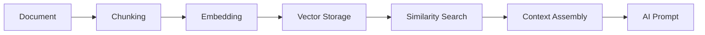
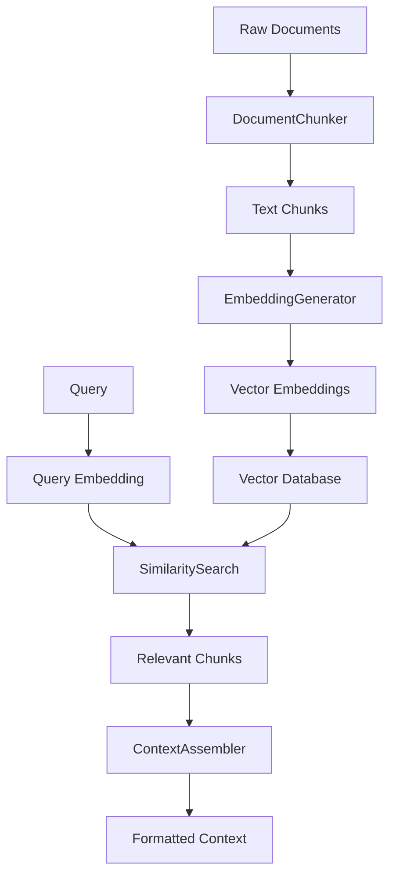

# RAGService Dökümantasyonu

RAGService (Retrieval-Augmented Generation), ArchBuilder.AI'ın bilgi yönetimi ve context-aware AI response sistemidir. Bu servis, building codes, regulations ve project documents'tan oluşturulan knowledge base'i kullanarak AI modellerine relevant context sağlar.

Not: Bu sürümde RAGService, RAGFlow ile entegredir ve aşağıdaki upstream endpoint'leri proxy'ler:
- `POST /api/v1/retrieval` (RAGFlow) → `POST /v1/rag/query` (ArchBuilder)
- `POST /api/{version}/datasets` (RAGFlow) – programatik dataset oluşturma
- `POST /api/{version}/datasets/{dataset_id}/documents` – çoklu dosya yükleme
- `POST /api/{version}/datasets/{dataset_id}/chunks` – parse/index başlatma

## 📋 İçindekiler

1. [Genel Bakış](#genel-bakış)
2. [RAG Architecture](#rag-architecture)
3. [Document Chunking](#document-chunking)
4. [Embedding Generation](#embedding-generation)
5. [Similarity Search](#similarity-search)
6. [Knowledge Base Yönetimi](#knowledge-base-yönetimi)
7. [Multi-language Support](#multi-language-support)
8. [Performance Optimization](#performance-optimization)
9. [Kullanım Örnekleri](#kullanım-örnekleri)

## 🔍 Genel Bakış

RAGService aşağıdaki temel işlevleri sağlar:

### Ana İşlevler
- **Document Chunking**: İçeriği anlamlı parçalara böler
- **Embedding Generation**: Text embeddings oluşturur
- **Similarity Search**: Benzer içerik arama
- **Context Assembly**: AI için relevant context hazırlar
- **Knowledge Management**: Bilgi tabanı yönetimi
- **Multi-language**: Çok dilli içerik desteği

### RAG Workflow


## 🏗️ RAG Architecture

### System Components
```python
RAGService
├── DocumentChunker       # Intelligent content chunking
├── EmbeddingGenerator   # Vector embedding creation
├── SimilaritySearchEngine # Semantic search
├── ContextAssembler     # Context preparation for AI
├── KnowledgeManager     # Knowledge base operations
└── MultilingualHandler  # Language-specific processing
```

### Data Flow Architecture


## 🧩 Ana Bileşenler

### 1. DocumentChunker
Intelligent content chunking with context preservation.

```python
class DocumentChunker:
    async def chunk_document(
        self,
        content: str,
        document_type: str,
        language: str,
        chunk_strategy: ChunkStrategy
    ) -> List[DocumentChunk]
```

**Chunking Strategies**:
```python
class ChunkStrategy(Enum):
    SEMANTIC = "semantic"           # Content-aware chunking
    FIXED_SIZE = "fixed_size"       # Fixed character/token count
    SENTENCE = "sentence"           # Sentence-based chunking
    PARAGRAPH = "paragraph"         # Paragraph-based chunking
    REGULATION_ARTICLE = "article"  # Building code articles
    CAD_LAYER = "cad_layer"        # CAD layer-based chunks
```

**Content-Aware Chunking Examples**:
```python
# Building Regulation Chunking
async def chunk_regulation_content(
    self,
    content: str,
    language: str
) -> List[DocumentChunk]:
    
    # 1. Detect regulation structure
    structure = await self._detect_regulation_structure(content, language)
    
    # 2. Split by articles/sections
    articles = await self._split_by_articles(content, structure)
    
    chunks = []
    for article in articles:
        chunk = DocumentChunk(
            content=article.content,
            chunk_type="regulation_article",
            metadata={
                "article_number": article.number,
                "section": article.section,
                "subsection": article.subsection,
                "regulation_type": article.regulation_type
            },
            language=language
        )
        chunks.append(chunk)
    
    return chunks

# CAD Drawing Chunking
async def chunk_cad_content(
    self,
    cad_data: CADParseResult,
    language: str
) -> List[DocumentChunk]:
    
    chunks = []
    
    # Chunk by layers
    for layer in cad_data.layers:
        layer_content = self._format_layer_content(layer, cad_data.entities)
        
        chunk = DocumentChunk(
            content=layer_content,
            chunk_type="cad_layer",
            metadata={
                "layer_name": layer.name,
                "entity_count": len(layer.entities),
                "layer_type": layer.layer_type
            },
            language=language
        )
        chunks.append(chunk)
    
    # Chunk by text elements
    for text_element in cad_data.text_elements:
        chunk = DocumentChunk(
            content=text_element.content,
            chunk_type="cad_text",
            metadata={
                "position": text_element.position,
                "font_size": text_element.font_size,
                "layer": text_element.layer
            },
            language=language
        )
        chunks.append(chunk)
    
    return chunks
```

### 2. EmbeddingGenerator
Vector embedding generation with multiple model support.

```python
class EmbeddingGenerator:
    async def generate_embedding(
        self,
        text: str,
        embedding_model: str = "tfidf",
        language: str = "tr"
    ) -> List[float]
```

**Supported Models**:
- **TF-IDF**: Fast, lightweight, good for technical terms
- **Sentence-BERT**: Semantic embeddings
- **OpenAI**: (Future implementation)
- **Multilingual-BERT**: Cross-language support

**TF-IDF Implementation**:
```python
async def _generate_tfidf_embedding(
    self,
    text: str,
    language: str
) -> List[float]:
    
    # 1. Preprocess text
    processed_text = await self._preprocess_text(text, language)
    
    # 2. Get or create TF-IDF vectorizer for language
    vectorizer = await self._get_tfidf_vectorizer(language)
    
    # 3. Generate embedding
    embedding = vectorizer.transform([processed_text])
    
    # 4. Convert to list and normalize
    embedding_vector = embedding.toarray()[0].tolist()
    
    return self._normalize_vector(embedding_vector)

async def _preprocess_text(
    self,
    text: str,
    language: str
) -> str:
    
    # Language-specific preprocessing
    if language == "tr":
        # Turkish text preprocessing
        text = self._turkish_text_preprocessing(text)
    elif language == "en":
        # English text preprocessing
        text = self._english_text_preprocessing(text)
    
    # Common preprocessing
    text = text.lower()
    text = re.sub(r'[^\w\s]', ' ', text)  # Remove punctuation
    text = re.sub(r'\s+', ' ', text)      # Normalize whitespace
    
    return text.strip()
```

### 3. SimilaritySearchEngine
Semantic similarity search with multiple algorithms.

```python
class SimilaritySearchEngine:
    async def search_similar_chunks(
        self,
        query_embedding: List[float],
        max_results: int = 10,
        similarity_threshold: float = 0.3,
        filters: Optional[Dict[str, Any]] = None
    ) -> List[SimilarityResult]
```

**Similarity Algorithms**:
```python
class SimilarityAlgorithm(Enum):
    COSINE = "cosine"               # Cosine similarity
    EUCLIDEAN = "euclidean"         # Euclidean distance
    DOT_PRODUCT = "dot_product"     # Dot product similarity
    JACCARD = "jaccard"             # Jaccard similarity (for sets)
```

**Search Implementation**:
```python
async def _perform_cosine_similarity_search(
    self,
    query_embedding: List[float],
    candidate_embeddings: List[Tuple[str, List[float]]],
    max_results: int
) -> List[SimilarityResult]:
    
    similarities = []
    query_norm = np.linalg.norm(query_embedding)
    
    for chunk_id, candidate_embedding in candidate_embeddings:
        # Calculate cosine similarity
        dot_product = np.dot(query_embedding, candidate_embedding)
        candidate_norm = np.linalg.norm(candidate_embedding)
        
        if query_norm > 0 and candidate_norm > 0:
            similarity = dot_product / (query_norm * candidate_norm)
        else:
            similarity = 0.0
        
        similarities.append(SimilarityResult(
            chunk_id=chunk_id,
            similarity_score=similarity,
            algorithm_used="cosine"
        ))
    
    # Sort by similarity score (descending)
    similarities.sort(key=lambda x: x.similarity_score, reverse=True)
    
    return similarities[:max_results]
```

### 4. ContextAssembler
AI prompt context preparation and formatting.

```python
class ContextAssembler:
    async def assemble_context(
        self,
        relevant_chunks: List[DocumentChunk],
        query: str,
        max_context_length: int = 4000,
        language: str = "tr"
    ) -> AssembledContext
```

**Context Assembly Strategies**:
```python
async def _assemble_regulation_context(
    self,
    chunks: List[DocumentChunk],
    query: str,
    language: str
) -> str:
    
    context_parts = []
    
    if language == "tr":
        context_parts.append("İlgili Yönetmelik Maddeleri:")
    else:
        context_parts.append("Relevant Building Code Articles:")
    
    for chunk in chunks:
        if chunk.chunk_type == "regulation_article":
            article_num = chunk.metadata.get("article_number", "N/A")
            section = chunk.metadata.get("section", "")
            
            if language == "tr":
                header = f"\nMadde {article_num} ({section}):"
            else:
                header = f"\nArticle {article_num} ({section}):"
            
            context_parts.append(header)
            context_parts.append(chunk.content)
    
    return "\n".join(context_parts)

async def _assemble_cad_context(
    self,
    chunks: List[DocumentChunk],
    query: str,
    language: str
) -> str:
    
    context_parts = []
    
    if language == "tr":
        context_parts.append("İlgili CAD Bilgileri:")
    else:
        context_parts.append("Relevant CAD Information:")
    
    # Group by chunk type
    layer_chunks = [c for c in chunks if c.chunk_type == "cad_layer"]
    text_chunks = [c for c in chunks if c.chunk_type == "cad_text"]
    
    # Add layer information
    if layer_chunks:
        if language == "tr":
            context_parts.append("\nKatman Bilgileri:")
        else:
            context_parts.append("\nLayer Information:")
        
        for chunk in layer_chunks:
            layer_name = chunk.metadata.get("layer_name", "Unknown")
            entity_count = chunk.metadata.get("entity_count", 0)
            context_parts.append(f"- {layer_name}: {entity_count} elementi")
    
    # Add text elements
    if text_chunks:
        if language == "tr":
            context_parts.append("\nÇizim Metinleri:")
        else:
            context_parts.append("\nDrawing Texts:")
        
        for chunk in text_chunks:
            context_parts.append(f"- {chunk.content}")
    
    return "\n".join(context_parts)
```

## 🗃️ Knowledge Base Yönetimi

### Document Storage Structure
```python
class KnowledgeManager:
    async def store_document_chunks(
        self,
        chunks: List[DocumentChunk],
        document_id: str,
        correlation_id: str
    ) -> StorageResult
```

**Storage Schema**:
```python
# Document metadata
document_metadata = {
    "document_id": "doc_123",
    "file_name": "building_code_tr.pdf",
    "document_type": "regulation",
    "language": "tr",
    "upload_date": "2024-01-15T10:30:00Z",
    "file_size": 2048576,
    "chunk_count": 245,
    "processing_status": "completed"
}

# Chunk storage
chunk_storage = {
    "chunk_id": "chunk_123_001",
    "document_id": "doc_123",
    "content": "Yangın güvenliği için...",
    "chunk_type": "regulation_article",
    "embedding": [0.1, 0.2, 0.3, ...],
    "metadata": {
        "article_number": "15.2.3",
        "section": "Yangın Güvenliği",
        "page_number": 47
    },
    "language": "tr",
    "created_at": "2024-01-15T10:35:00Z"
}
```

### Knowledge Base Operations
```python
# Add new document
async def add_document_to_knowledge_base(
    self,
    document: ProcessedDocument,
    correlation_id: str
) -> str:
    
    # 1. Generate document ID
    document_id = f"doc_{uuid.uuid4().hex[:8]}"
    
    # 2. Store document metadata
    await self._store_document_metadata(document_id, document.metadata)
    
    # 3. Store chunks with embeddings
    for chunk in document.chunks:
        await self._store_chunk(document_id, chunk)
    
    # 4. Update search indexes
    await self._update_search_indexes(document_id)
    
    return document_id

# Query knowledge base
async def query_knowledge_base(
    self,
    query: str,
    document_types: List[str] = None,
    languages: List[str] = None,
    max_results: int = 10
) -> QueryResult:
    
    # 1. Generate query embedding
    query_embedding = await self.embedding_generator.generate_embedding(
        text=query,
        language=languages[0] if languages else "tr"
    )
    
    # 2. Apply filters
    filters = {}
    if document_types:
        filters["document_type"] = {"$in": document_types}
    if languages:
        filters["language"] = {"$in": languages}
    
    # 3. Perform similarity search
    similar_chunks = await self.similarity_engine.search_similar_chunks(
        query_embedding=query_embedding,
        max_results=max_results,
        filters=filters
    )
    
    # 4. Retrieve chunk content
    chunks = []
    for result in similar_chunks:
        chunk = await self._get_chunk_by_id(result.chunk_id)
        chunk.similarity_score = result.similarity_score
        chunks.append(chunk)
    
    return QueryResult(
        query=query,
        chunks=chunks,
        total_results=len(chunks)
    )

# Update document
async def update_document_in_knowledge_base(
    self,
    document_id: str,
    updated_content: str,
    correlation_id: str
) -> bool:
    
    # 1. Remove old chunks
    await self._remove_document_chunks(document_id)
    
    # 2. Re-process document
    new_chunks = await self.document_chunker.chunk_document(
        content=updated_content,
        document_type="updated",
        language="tr"
    )
    
    # 3. Generate new embeddings
    for chunk in new_chunks:
        chunk.embedding = await self.embedding_generator.generate_embedding(
            text=chunk.content
        )
    
    # 4. Store updated chunks
    for chunk in new_chunks:
        await self._store_chunk(document_id, chunk)
    
    return True
```

## 🌍 Multi-language Support

### Language-Specific Processing
```python
class MultilingualHandler:
    async def process_multilingual_content(
        self,
        content: str,
        detected_language: str,
        target_languages: List[str]
    ) -> MultilingualContent
```

**Supported Languages**:
- **Turkish (tr)**: Native building codes
- **English (en)**: International standards
- **German (de)**: European regulations
- **French (fr)**: European regulations
- **Spanish (es)**: International projects

**Language Detection**:
```python
async def detect_content_language(
    self,
    content: str
) -> LanguageDetectionResult:
    
    # 1. Character-based detection
    char_based_lang = self._detect_by_characters(content)
    
    # 2. Word-based detection
    word_based_lang = self._detect_by_words(content)
    
    # 3. Pattern-based detection (for regulations)
    pattern_based_lang = self._detect_by_patterns(content)
    
    # 4. Combine results with confidence scoring
    final_language = self._combine_detection_results(
        char_based_lang,
        word_based_lang,
        pattern_based_lang
    )
    
    return LanguageDetectionResult(
        detected_language=final_language.language,
        confidence_score=final_language.confidence,
        alternative_languages=final_language.alternatives
    )
```

### Cross-Language Search
```python
async def search_across_languages(
    self,
    query: str,
    query_language: str,
    target_languages: List[str],
    max_results: int = 10
) -> CrossLanguageSearchResult:
    
    results_by_language = {}
    
    for target_lang in target_languages:
        # 1. Translate query if needed
        if query_language != target_lang:
            translated_query = await self._translate_query(
                query, query_language, target_lang
            )
        else:
            translated_query = query
        
        # 2. Search in target language
        lang_results = await self.query_knowledge_base(
            query=translated_query,
            languages=[target_lang],
            max_results=max_results
        )
        
        results_by_language[target_lang] = lang_results
    
    # 3. Combine and rank results
    combined_results = self._combine_multilingual_results(results_by_language)
    
    return CrossLanguageSearchResult(
        original_query=query,
        query_language=query_language,
        results_by_language=results_by_language,
        combined_results=combined_results
    )
```

## ⚡ Performance Optimization

### Embedding Caching
```python
class EmbeddingCache:
    async def get_cached_embedding(
        self,
        text_hash: str,
        embedding_model: str
    ) -> Optional[List[float]]:
        
        cache_key = f"embedding:{embedding_model}:{text_hash}"
        
        # Try memory cache first
        if cache_key in self.memory_cache:
            return self.memory_cache[cache_key]
        
        # Try Redis cache
        cached_value = await self.redis_cache.get(cache_key)
        if cached_value:
            embedding = json.loads(cached_value)
            # Store in memory cache for faster access
            self.memory_cache[cache_key] = embedding
            return embedding
        
        return None
    
    async def cache_embedding(
        self,
        text_hash: str,
        embedding_model: str,
        embedding: List[float],
        ttl: int = 3600
    ) -> None:
        
        cache_key = f"embedding:{embedding_model}:{text_hash}"
        
        # Store in memory cache
        self.memory_cache[cache_key] = embedding
        
        # Store in Redis cache
        await self.redis_cache.setex(
            cache_key,
            ttl,
            json.dumps(embedding)
        )
```

### Batch Processing
```python
async def process_documents_batch(
    self,
    documents: List[Document],
    batch_size: int = 10
) -> List[ProcessingResult]:
    
    results = []
    
    # Process in batches to manage memory
    for i in range(0, len(documents), batch_size):
        batch = documents[i:i + batch_size]
        
        # Process batch in parallel
        batch_tasks = [
            self._process_single_document(doc)
            for doc in batch
        ]
        
        batch_results = await asyncio.gather(
            *batch_tasks,
            return_exceptions=True
        )
        
        results.extend(batch_results)
        
        # Memory cleanup between batches
        await self._cleanup_temp_resources()
    
    return results
```

### Search Index Optimization
```python
class SearchIndexManager:
    async def create_optimized_indexes(
        self,
        document_type: str,
        language: str
    ) -> None:
        
        # Create compound indexes for fast filtering
        await self._create_compound_index([
            ("document_type", 1),
            ("language", 1),
            ("similarity_score", -1)
        ])
        
        # Create text indexes for metadata search
        await self._create_text_index([
            "content",
            "metadata.title",
            "metadata.section"
        ])
        
        # Create geospatial indexes for location-based chunks
        if document_type == "cad":
            await self._create_geospatial_index("metadata.coordinates")
```

## 💡 Kullanım Örnekleri

### Building Code Query
```python
# Query building regulations
query_request = RAGQueryRequest(
    query="yangın güvenliği merdiven genişliği",
    document_types=["regulation"],
    languages=["tr"],
    max_results=5
)

response = await rag_service.query_knowledge_base(
    request=query_request,
    correlation_id="query_123"
)

# Use results in AI prompt
context = await rag_service.assemble_context(
    relevant_chunks=response.chunks,
    query=query_request.query,
    language="tr"
)

print(f"Found {len(response.chunks)} relevant chunks")
print(f"Context length: {len(context.formatted_content)} characters")
```

### CAD Drawing Analysis
```python
# Query CAD-related information
cad_query = RAGQueryRequest(
    query="electrical outlet placement in kitchens",
    document_types=["cad", "regulation"],
    languages=["en", "tr"],
    max_results=8
)

response = await rag_service.query_knowledge_base(
    request=cad_query,
    correlation_id="cad_query_456"
)

# Filter by chunk type
regulation_chunks = [c for c in response.chunks if c.chunk_type == "regulation_article"]
cad_chunks = [c for c in response.chunks if c.chunk_type.startswith("cad_")]

print(f"Regulation chunks: {len(regulation_chunks)}")
print(f"CAD chunks: {len(cad_chunks)}")
```

### Document Processing Pipeline
```python
# Process and add new regulation document
document_request = DocumentProcessRequest(
    file_path="/uploads/new_building_code.pdf",
    document_type="regulation",
    language="tr",
    metadata={
        "title": "New Building Code 2024",
        "authority": "Ministry of Environment",
        "effective_date": "2024-01-01"
    }
)

# Process document
processing_result = await rag_service.process_and_store_document(
    request=document_request,
    correlation_id="process_789"
)

if processing_result.success:
    print(f"Document processed: {processing_result.document_id}")
    print(f"Chunks created: {processing_result.chunk_count}")
    print(f"Processing time: {processing_result.processing_time_ms}ms")
```

### Cross-Language Search
```python
# Search across multiple languages
multilingual_query = CrossLanguageQueryRequest(
    query="fire safety requirements",
    query_language="en",
    target_languages=["tr", "de", "fr"],
    max_results_per_language=3
)

response = await rag_service.search_across_languages(
    request=multilingual_query,
    correlation_id="multilang_101"
)

# Results by language
for language, results in response.results_by_language.items():
    print(f"{language}: {len(results.chunks)} chunks found")
    for chunk in results.chunks:
        print(f"  - {chunk.content[:100]}...")
```

## 📊 Performance Metrikleri

### Target Performance
- **Embedding Generation**: <200ms per chunk
- **Similarity Search**: <100ms for 10K chunks
- **Context Assembly**: <50ms
- **Document Processing**: <30 seconds per MB
- **Query Response**: <500ms total

### Monitoring Metrics
```python
{
    "rag_service_metrics": {
        "total_documents": 1543,
        "total_chunks": 87429,
        "average_chunks_per_doc": 56.7,
        "embedding_cache_hit_rate": 0.67,
        "search_response_time_ms": 145,
        "context_assembly_time_ms": 32,
        "language_distribution": {
            "tr": 0.48,
            "en": 0.31,
            "de": 0.12,
            "fr": 0.09
        },
        "document_type_distribution": {
            "regulation": 0.52,
            "cad": 0.31,
            "reference": 0.17
        }
    }
}
```

## 🔧 Configuration

### Environment Variables
```bash
# Embedding Configuration
EMBEDDING_MODEL=tfidf
EMBEDDING_CACHE_TTL=3600
MAX_EMBEDDING_BATCH_SIZE=100

# Search Configuration
DEFAULT_SIMILARITY_THRESHOLD=0.3
MAX_SEARCH_RESULTS=50
SEARCH_TIMEOUT_MS=1000

# Language Configuration
DEFAULT_LANGUAGE=tr
SUPPORTED_LANGUAGES=tr,en,de,fr,es
ENABLE_LANGUAGE_DETECTION=true

# Storage Configuration
CHUNK_STORAGE_PATH=/data/chunks
EMBEDDING_STORAGE_PATH=/data/embeddings
INDEX_STORAGE_PATH=/data/indexes
```

### RAG Configuration
```python
RAG_CONFIG = {
    "chunking": {
        "default_strategy": "semantic",
        "max_chunk_size": 1000,
        "chunk_overlap": 200,
        "min_chunk_size": 100
    },
    "embedding": {
        "model": "tfidf",
        "vector_size": 512,
        "cache_enabled": True,
        "batch_size": 50
    },
    "search": {
        "algorithm": "cosine",
        "threshold": 0.3,
        "max_results": 10,
        "enable_filtering": True
    },
    "context": {
        "max_context_length": 4000,
        "include_metadata": True,
        "format_style": "structured"
    }
}

### RAGFlow Entegrasyon Ayarları
```env
RAGFLOW_BASE_URL=http://localhost
RAGFLOW_API_KEY=your_ragflow_api_key
RAGFLOW_API_VERSION=v1
RAGFLOW_TIMEOUT_SECONDS=30
```

```python
from app.core.config import settings

print(settings.ragflow_base_url)
```
```

---

**Bu dokümantasyon RAGService'in tüm bilgi yönetimi ve semantic search yeteneklerini kapsamaktadır. Vector database ve advanced embedding model entegrasyonları için kaynak kod incelenebilir.**